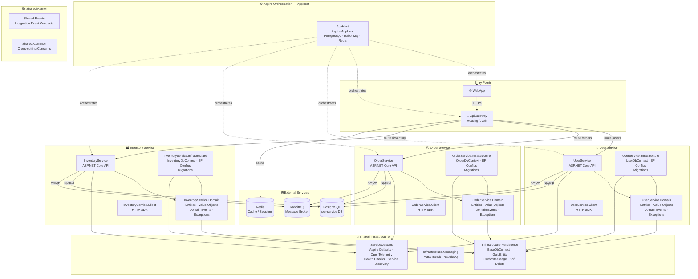
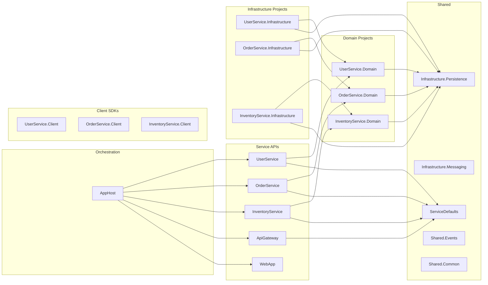
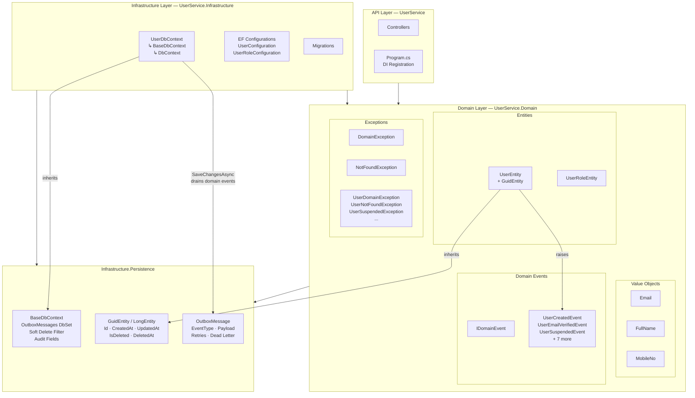
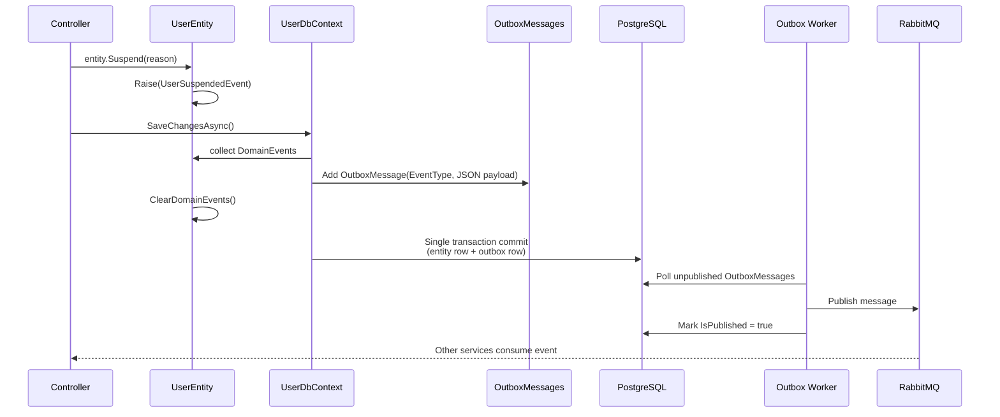

## Introduction
This repository is example implementation of microservices architecture and design patterns. It uses mix architecture called "Microservices with Clean Architecture and DDD" or "Distributed Clean Architecture", more inspired by [eShopOnContainers Architecture](https://github.com/dotnet/eShop/tree/main/src).
This purpoose of writing this repo is not build a functional application, but to show how to implement microservices architecture and design patterns in a simple way. It is not a production ready code, but it can be used as a reference for learning and understanding the concepts.

## Project Structure
The solution is organized into multiple projects, each representing a different layer or component of the architecture.

```
src/
│
├── AppHost/                          ← .NET Aspire orchestration
│
├── Gateway/
│   └── ApiGateway/                   ← YARP reverse proxy
│
├── App/
│   └── WebApp/                       ← Frontend client
│
├── Services/
│   ├── UserService/                  ← ASP.NET Core API
│   ├── OrderService/
│   └── InventoryService/
│
├── Domain/
│   ├── UserService.Domain/           ← Entities, VOs, Events, Exceptions
│   │   ├── Entities/
│   │   ├── ValueObjects/
│   │   ├── Events/
│   │   └── Exceptions/
│   ├── OrderService.Domain/
│   └── InventoryService.Domain/
│
├── Infrastructure/
│   ├── Infrastructure.Persistence/   ← Shared base (BaseDbContext, GuidEntity, Outbox)
│   │   ├── BaseDbContext.cs
│   │   ├── Entities/                 ← BaseEntity, GuidEntity, LongEntity
│   │   └── Outbox/                   ← OutboxMessage
│   │
│   ├── Infrastructure.Messaging/     ← Shared messaging (MassTransit / RabbitMQ)
│   │
│   ├── UserService.Infrastructure/   ← User-specific EF Core wiring
│   │   ├── UserDbContext.cs
│   │   ├── Configurations/
│   │   │   ├── UserConfiguration.cs
│   │   │   └── UserRoleConfiguration.cs
│   │   └── Migrations/
│   │
│   ├── OrderService.Infrastructure/
│   │   ├── OrderDbContext.cs
│   │   ├── Configurations/
│   │   └── Migrations/
│   │
│   └── InventoryService.Infrastructure/
│       ├── InventoryDbContext.cs
│       ├── Configurations/
│       └── Migrations/
│
├── Clients/
│   ├── UserService.Client/           ← Typed HTTP SDK
│   ├── OrderService.Client/
│   └── InventoryService.Client/
│
└── Shared/
    ├── Shared.Common/                ← Cross-cutting concerns
    ├── Shared.Events/                ← Integration event contracts
    └── ServiceDefaults/              ← Aspire defaults, OpenTelemetry
```


## It's architecture contains:
| Pattern | Where in your solution |
|---------|------------------------|
|Clean Architecture    |    Layer separation|
|DDD                   |    Domain folder (entities, VO, exceptions)|
|Microservices         |    Services folder|
|Outbox Pattern        |    Infrastructure.Persistence/Outbox|
|Client SDK Pattern    |    Clients folder|
|Shared Kernel         |    Shared folder|
|API Gateway           |    Gateway folder|
|Modular Monorepo      |    Single solution, multiple projects|

## Microservices
- **User Service**: Manages users of the system.
- **Order Service**: Manages orders and their lifecycle.
- **Inventory Service**: Manages inventory and stock levels.

---

## Devloper Guide Lines:
   - The solution is monorepo microservices architecture, where all services and shared libraries are in a single solution for easier development and code sharing.
   - The solution has central package management for consistent dependency versions across projects.
   - Each service has its own database and is responsible for its own data management, following the database per service pattern.
   - Each service is an independent ASP.NET Core Web API project.
   - The domain layer is separated into its own project for each service, containing entities, value objects, domain events, and exceptions.
   - The auto generated ids are are guide version 7 for better performance and scalability. As it uses time-based UUIDs, it provides better indexing and query performance compared to random UUIDs, especially in high-concurrency scenarios.

## Solution Diagrams

### High-Level Architecture



---

### Project Dependency Graph



---

### Clean Architecture Layers *(UserService — fully implemented)*



---

### Outbox Pattern Flow


