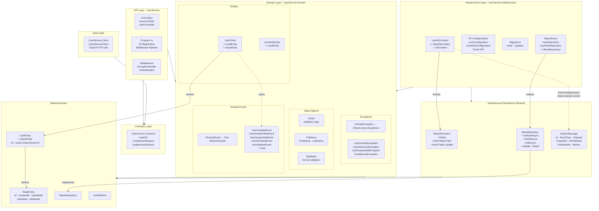
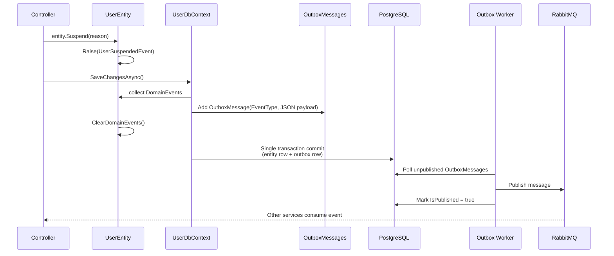
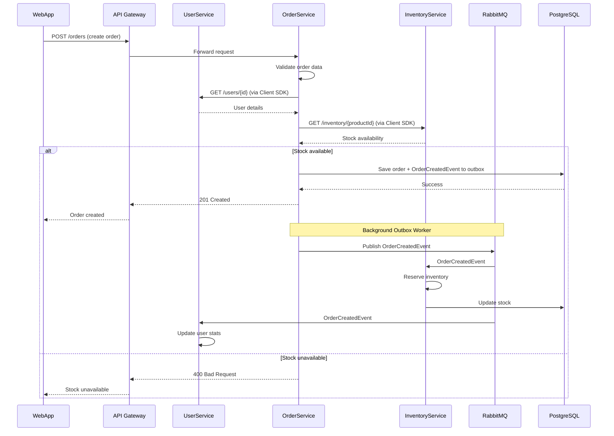
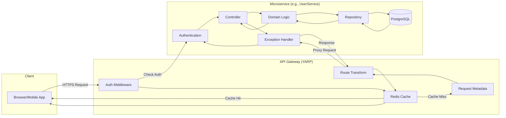
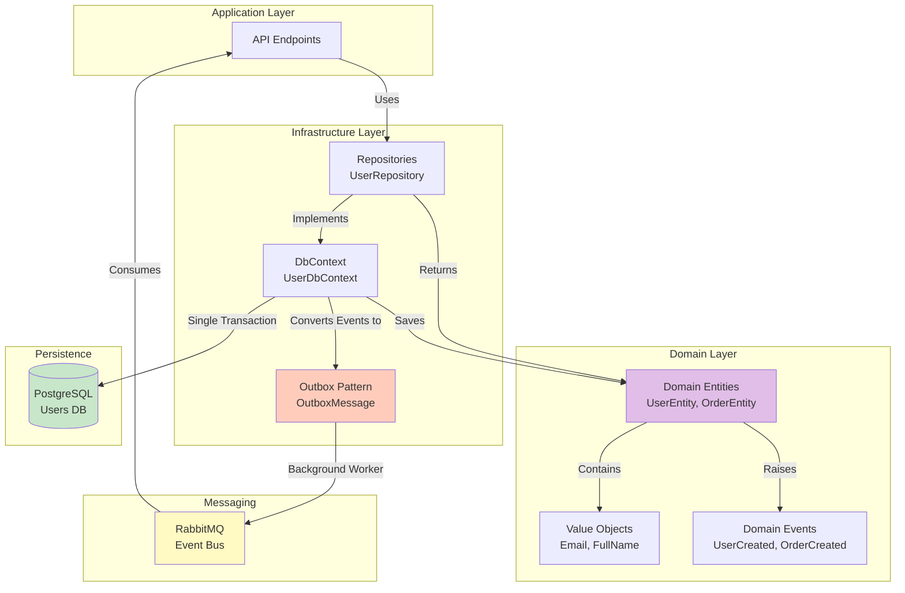
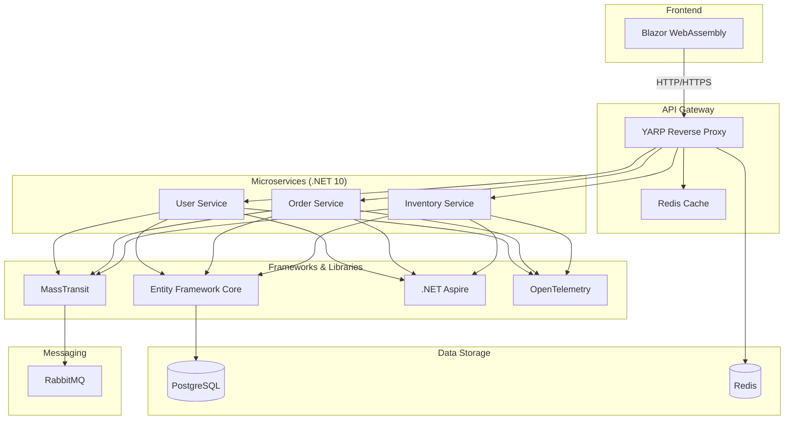

# Learning Microservices with .NET 10

[](https://dotnet.microsoft.com/)
[](https://docs.microsoft.com/en-us/dotnet/csharp/)
[](https://github.com/Asifnawazmiani/LearningMircoservices)

> A comprehensive example of microservices architecture using .NET 10, Clean Architecture, and Domain-Driven Design (DDD)

---

## Project Overview

This repository demonstrates how to build a modern microservices architecture with:
- **Clean Architecture** with clear layer separation
- **Domain-Driven Design** with rich domain models
- **Microservices** pattern with independent deployments
- **Event-Driven** communication via RabbitMQ (infrastructure in place)
- **Database per Service** with PostgreSQL
- **API Gateway** using YARP
- **.NET Aspire** for orchestration and observability

**Note**: This is a learning/reference project. Core infrastructure is implemented, but some features like inter-service messaging via RabbitMQ, service-to-service API calls, and Redis caching are scaffolded but not yet active.

---

## Introduction
This repository is an example implementation of microservices architecture and design patterns. It uses a mixed architecture called "Microservices with Clean Architecture and DDD" or "Distributed Clean Architecture", inspired by [eShopOnContainers Architecture](https://github.com/dotnet/eShop/tree/main/src).

The purpose of this repository is not to build a functional application, but to demonstrate how to implement microservices architecture and design patterns in a practical way. It is not production-ready code, but it serves as a reference for learning and understanding these concepts.

**Key Technologies:**
- **.NET 10** - Latest .NET platform
- **C# 14** - Modern C# features
- **.NET Aspire** - Cloud-native orchestration
- **Entity Framework Core** - ORM
- **PostgreSQL** - Database per service
- **RabbitMQ** - Message broker
- **MassTransit** - Messaging abstraction
- **YARP** - API Gateway
- **Redis** - Caching

## Project Structure

The solution is organized into multiple projects following clean architecture and microservices patterns:

```
src/
│
├── .github/                                      # GitHub configuration
│   └── workflows/                                # CI/CD workflows
│
├── docs/                                         # Documentation
│   ├── ARCHITECTURE.md                           # Detailed architecture documentation
│   ├── DIAGRAMS.md                               # Visual diagrams reference
│   ├── INDEX.md                                  # Documentation index
│   └── SUMMARY.md                                # Documentation summary
│
├── AppHost/                                      # .NET Aspire Orchestration
│   ├── Program.cs                                # Aspire configuration and service registration
│   └── AppHost.csproj
│
├── ApiGateway/                                   # API Gateway (YARP)
│   ├── Controllers/
│   ├── Middlewares/
│   │   └── RequestMetadataMiddleware.cs          # Request logging and metadata
│   ├── Program.cs                                # Gateway configuration
│   ├── appsettings.json                          # Configuration (routes, clusters)
│   └── ApiGateway.csproj
│
├── WebApp/                                       # Blazor Frontend
│   ├── Components/                               # Blazor components
│   ├── Program.cs
│   └── WebApp.csproj
│
├── UserService/                                  # User Service API
│   ├── Controllers/
│   │   └── UsersController.cs                    # User CRUD endpoints
│   ├── Program.cs                                # Service configuration, DI
│   └── UserService.csproj
│
├── UserService.Domain/                           # User Domain Layer
│   ├── Entities/
│   │   ├── UserEntity.cs                         # User aggregate root
│   │   └── UserRoleEntity.cs
│   ├── ValueObjects/
│   │   ├── Email.cs                              # Email with validation
│   │   ├── FullName.cs
│   │   └── MobileNo.cs
│   ├── Events/
│   │   ├── UserCreatedEvent.cs
│   │   ├── UserEmailVerifiedEvent.cs
│   │   ├── UserSuspendedEvent.cs
│   │   ├── UserActivatedEvent.cs
│   │   └── ... (10+ domain events)
│   ├── Exceptions/
│   │   ├── UserDomainException.cs
│   │   ├── UserNotFoundException.cs
│   │   └── ...
│   ├── Services/                                 # Domain Services (not yet implemented)
│   │   ├── IPasswordHashingService.cs            # Password hashing logic
│   │   ├── IUserAuthenticationService.cs         # Authentication logic
│   │   └── IUserRegistrationService.cs           # User registration workflow
│   ├── Repositories/
│   │   ├── IUserRepository.cs
│   │   └── IUserRoleRepository.cs
│   ├── UserService.Domain.csproj
│   └── README.md
│
├── UserService.Infrastructure/                   # User Infrastructure Layer
│   ├── UserDbContext.cs                          # EF Core DbContext
│   ├── Configurations/
│   │   ├── UserConfiguration.cs                  # UserEntity fluent configuration
│   │   └── UserRoleConfiguration.cs
│   ├── Repositories/
│   │   ├── UserRepository.cs
│   │   └── UserRoleRepository.cs
│   ├── Migrations/                               # EF Core migrations
│   ├── UserService.Infrastructure.csproj
│   └── README.md
│
├── UserService.Contracts/                        # User Service API Contracts
│   ├── Requests/
│   │   ├── CreateUserRequest.cs
│   │   ├── UpdateUserRequest.cs
│   │   └── AssignRoleRequest.cs
│   ├── Responses/
│   │   ├── UserResponse.cs
│   │   └── UserRoleResponse.cs
│   └── UserService.Contracts.csproj
│
├── UserService.Client/                           # User Service HTTP Client SDK
│   ├── IUserServiceClient.cs
│   ├── UserServiceClient.cs
│   ├── UserService.Client.csproj
│   └── README.md
│
├── OrderService/                                 # Order Service API
│   ├── Controllers/
│   │   └── OrdersController.cs
│   ├── Program.cs
│   └── OrderService.csproj
│
├── OrderService.Domain/                          # Order Domain Layer
│   ├── Entities/
│   │   ├── OrderEntity.cs                        # Order aggregate root
│   │   └── OrderItemEntity.cs
│   ├── ValueObjects/
│   │   ├── Money.cs
│   │   ├── Address.cs
│   │   └── OrderStatus.cs
│   ├── Events/
│   │   ├── OrderCreatedEvent.cs
│   │   ├── OrderCancelledEvent.cs
│   │   ├── OrderShippedEvent.cs
│   │   └── OrderCompletedEvent.cs
│   ├── Exceptions/
│   │   ├── OrderDomainException.cs
│   │   ├── OrderNotFoundException.cs
│   │   └── InvalidOrderStateException.cs
│   ├── Services/                                 # Domain Services (not yet implemented)
│   │   ├── IOrderValidationService.cs            # Order validation logic
│   │   ├── IPricingService.cs                    # Pricing calculation
│   │   └── IOrderWorkflowService.cs              # Order state transitions
│   ├── Repositories/
│   │   └── IOrderRepository.cs
│   ├── OrderService.Domain.csproj
│   └── README.md
│
├── OrderService.Infrastructure/                  # Order Infrastructure Layer
│   ├── OrderDbContext.cs
│   ├── Configurations/
│   │   ├── OrderConfiguration.cs
│   │   └── OrderItemConfiguration.cs
│   ├── Repositories/
│   │   └── OrderRepository.cs
│   ├── Migrations/
│   ├── OrderService.Infrastructure.csproj
│   └── README.md
│
├── OrderService.Contracts/                       # Order Service API Contracts
│   ├── Requests/
│   │   ├── CreateOrderRequest.cs
│   │   └── CancelOrderRequest.cs
│   ├── Responses/
│   │   └── OrderResponse.cs
│   └── OrderService.Contracts.csproj
│
├── OrderService.Client/                          # Order Service HTTP Client SDK
│   ├── IOrderServiceClient.cs
│   ├── OrderServiceClient.cs
│   └── OrderService.Client.csproj
│
├── InventoryService/                             # Inventory Service API
│   ├── Controllers/
│   │   └── InventoryController.cs
│   ├── Program.cs
│   └── InventoryService.csproj
│
├── InventoryService.Domain/                      # Inventory Domain Layer
│   ├── Entities/
│   │   └── ProductInventoryEntity.cs             # Product inventory aggregate root
│   ├── ValueObjects/
│   │   ├── StockQuantity.cs
│   │   └── SKU.cs
│   ├── Events/
│   │   ├── StockReservedEvent.cs
│   │   ├── StockReleasedEvent.cs
│   │   └── StockAdjustedEvent.cs
│   ├── Exceptions/
│   │   ├── InventoryDomainException.cs
│   │   ├── ProductNotFoundException.cs
│   │   └── InsufficientStockException.cs
│   ├── Repositories/
│   │   └── IProductInventoryRepository.cs
│   ├── InventoryService.Domain.csproj
│   └── README.md
│
├── InventoryService.Infrastructure/              # Inventory Infrastructure Layer
│   ├── InventoryDbContext.cs
│   ├── Configurations/
│   │   └── ProductInventoryConfiguration.cs
│   ├── Repositories/
│   │   └── ProductInventoryRepository.cs
│   ├── Migrations/
│   ├── InventoryService.Infrastructure.csproj
│   └── README.md
│
├── InventoryService.Contracts/                   # Inventory Service API Contracts
│   ├── Requests/
│   │   ├── ReserveStockRequest.cs
│   │   └── AdjustStockRequest.cs
│   ├── Responses/
│   │   └── InventoryResponse.cs
│   └── InventoryService.Contracts.csproj
│
├── InventoryService.Client/                      # Inventory Service HTTP Client SDK
│   ├── IInventoryServiceClient.cs
│   ├── InventoryServiceClient.cs
│   └── InventoryService.Client.csproj
│
├── Infrastructure.Persistence/                   # Shared Persistence Infrastructure
│   ├── BaseDbContext.cs                          # Base DbContext with outbox, soft delete, audit
│   ├── Outbox/
│   │   └── OutboxMessage.cs                      # Outbox message entity for reliable messaging
│   ├── Repositories/
│   │   ├── IBaseRepository.cs                    # Generic repository interface
│   │   └── BaseRepository.cs                     # Generic repository implementation
│   └── Infrastructure.Persistence.csproj
│
├── Infrastructure.Messaging/                     # Shared Messaging Infrastructure
│   ├── MassTransitConfiguration.cs               # MassTransit configuration
│   ├── MessageBrokerSettings.cs                  # RabbitMQ settings
│   ├── Infrastructure.Messaging.csproj
│   └── README.md
│
├── Infrastructure.Exceptions/                    # Shared Exception Handling
│   ├── DomainExceptions.cs                       # Base domain exception classes
│   ├── GlobalExceptionHandler.cs                 # Global exception middleware
│   ├── ExceptionExtensions.cs                    # Exception helper extensions
│   └── Infrastructure.Exceptions.csproj
│
├── Shared.Domain/                                # Shared Domain Building Blocks
│   ├── Entities/
│   │   └── BaseEntity.cs                         # Base entity with Id, audit fields, soft delete
│   ├── Events/
│   │   └── IDomainEvent.cs                       # Domain event marker interface
│   ├── Repositories/
│   │   └── IBaseRepository.cs                    # Generic repository interface
│   ├── UnitOfWork/
│   │   └── IUnitOfWork.cs                        # Unit of work interface
│   └── Shared.Domain.csproj
│
├── Shared.Events/                                # Shared Integration Events
│   ├── UserEvents/
│   │   ├── UserCreatedIntegrationEvent.cs
│   │   └── UserDeletedIntegrationEvent.cs
│   ├── OrderEvents/
│   │   ├── OrderCreatedIntegrationEvent.cs
│   │   └── OrderCancelledIntegrationEvent.cs
│   ├── InventoryEvents/
│   │   ├── StockReservedIntegrationEvent.cs
│   │   └── StockReleasedIntegrationEvent.cs
│   ├── Shared.Events.csproj
│   └── README.md
│
├── Shared.Common/                                # Shared Common Utilities
│   ├── Extensions/
│   │   ├── StringExtensions.cs
│   │   └── DateTimeExtensions.cs
│   ├── Helpers/
│   │   └── GuidGenerator.cs                      # GUID v7 generator
│   └── Shared.Common.csproj
│
├── ServiceDefaults/                              # Aspire Service Defaults
│   ├── Extensions.cs                             # Service configuration extensions
│   ├── HealthChecks/
│   │   └── DatabaseHealthCheck.cs
│   ├── OpenTelemetry/
│   │   └── OpenTelemetryExtensions.cs
│   └── ServiceDefaults.csproj
│
├── LearningMicroservices.sln                     # Solution file
├── Directory.Build.props                         # Shared MSBuild properties
├── Directory.Packages.props                      # Central package management
├── global.json                                   # .NET SDK version
├── .editorconfig                                 # Code style configuration
├── .gitignore                                    # Git ignore rules
└── ReadMe.md                                     # This file
```


## Architecture Patterns

| Pattern | Implementation | Location |
|---------|----------------|----------|
| **Clean Architecture** | Layer separation (API → Domain → Infrastructure) | Each service folder |
| **Domain-Driven Design (DDD)** | Entities, Value Objects, Domain Events, Aggregates | `*.Domain` projects |
| **Microservices** | Independent services with their own databases | Services folder |
| **Database per Service** | Each service has its own PostgreSQL database | Infrastructure projects |
| **Outbox Pattern** | Reliable event publishing via transactional outbox | `Infrastructure.Persistence/Outbox` |
| **Repository Pattern** | Data access abstraction | `Infrastructure.Persistence/Repositories` |
| **Unit of Work Pattern** | Transactional consistency | `Shared.Domain/UnitOfWork` |
| **Client SDK Pattern** | Type-safe service-to-service communication | `*.Client` projects |
| **Shared Kernel** | Common domain logic and contracts | `Shared.*` projects |
| **API Gateway** | Single entry point, routing, caching | `ApiGateway` |
| **Modular Monorepo** | Single solution with multiple projects | Root solution |
| **Service Discovery** | Aspire-based service resolution | `ServiceDefaults` |
| **CQRS (Partial)** | Separate read/write concerns in repositories | Domain/Infrastructure layers |

## Microservices

### User Service
**Responsibility**: User management, authentication, and authorization
- User registration and profile management
- Email verification and password reset
- Role-based access control (RBAC)
- User suspension and activation
- **Database**: PostgreSQL (users, user_roles tables)
- **Domain Events**: UserCreatedEvent, UserEmailVerifiedEvent, UserSuspendedEvent, etc.

### Order Service
**Responsibility**: Order lifecycle management
- Order creation and processing
- Order status tracking
- Order cancellation
- **Database**: PostgreSQL (orders table)
- **Integration**: Communicates with InventoryService for stock validation

### Inventory Service
**Responsibility**: Stock and inventory management
- Product inventory tracking
- Stock level management
- Inventory adjustments
- **Database**: PostgreSQL (inventory table)
- **Integration**: Listens to OrderCreatedEvent to reserve stock

---

## Developer Guidelines

### Architecture Principles
1. **Monorepo Microservices**: All services and shared libraries are in a single solution for easier development and code sharing
2. **Central Package Management**: Consistent dependency versions across all projects
3. **Database per Service**: Each service has its own database and manages its own data
4. **Service Independence**: Each service is an independent ASP.NET Core Web API project
5. **Domain Isolation**: Domain layer is separated into its own project for each service

### Code Standards
- **Entity IDs**: Use GUID Version 7 (time-based UUIDs) for better performance and scalability
  - Provides better indexing and query performance compared to random UUIDs
  - Especially beneficial in high-concurrency scenarios
- **Soft Deletes**: All entities support soft deletion via `IsDeleted` flag
- **Audit Fields**: Automatic tracking of `CreatedAt`, `UpdatedAt`, and `DeletedAt`
- **Domain Events**: Use domain events for intra-service communication
- **Integration Events**: Use integration events for inter-service communication via message broker

### Project Dependencies
- **Services** → Domain + Infrastructure + ServiceDefaults
- **Domain** → Shared.Domain
- **Infrastructure** → Domain + Infrastructure.Persistence
- **Clients** → Service.Contracts
- All projects follow strict dependency rules to maintain clean architecture

### Development Workflow
1. Define domain entities and value objects in `*.Domain` projects
2. Raise domain events within entities for important state changes
3. Implement infrastructure concerns in `*.Infrastructure` projects
4. Use outbox pattern for reliable event publishing
5. Expose APIs through `*.Contracts` for type-safe communication
6. Build client SDKs in `*.Client` projects for service-to-service calls

## Solution Diagrams

### High-Level Architecture

```mermaid
graph TB
    subgraph ORCH["Aspire Orchestration - AppHost"]
        AppHost["AppHost\n.NET Aspire\nPostgreSQL · RabbitMQ · Redis"]
    end

    subgraph ENTRY["Entry Points"]
        WebApp["WebApp\nBlazor Frontend"]
        GW["ApiGateway\nYARP Proxy\nRedis Cache · Auth"]
    end

    subgraph US["User Service"]
        direction TB
        US_API["UserService\nASP.NET Core API\nControllers · Endpoints"]
        US_DOM["UserService.Domain\nEntities · Value Objects\nDomain Events · Exceptions"]
        US_INF["UserService.Infrastructure\nUserDbContext\nEF Configurations · Migrations"]
        US_CLI["UserService.Client\nHTTP SDK"]
        US_CON["UserService.Contracts\nDTOs · API Models"]
        US_API --> US_DOM
        US_INF --> US_DOM
    end

    subgraph OS["Order Service"]
        direction TB
        OS_API["OrderService\nASP.NET Core API\nControllers · Endpoints"]
        OS_DOM["OrderService.Domain\nEntities · Value Objects\nDomain Events · Exceptions"]
        OS_INF["OrderService.Infrastructure\nOrderDbContext\nEF Configurations · Migrations"]
        OS_CLI["OrderService.Client\nHTTP SDK"]
        OS_CON["OrderService.Contracts\nDTOs · API Models"]
        OS_API --> OS_DOM
        OS_INF --> OS_DOM
    end

    subgraph IS["Inventory Service"]
        direction TB
        IS_API["InventoryService\nASP.NET Core API\nControllers · Endpoints"]
        IS_DOM["InventoryService.Domain\nEntities · Value Objects\nDomain Events · Exceptions"]
        IS_INF["InventoryService.Infrastructure\nInventoryDbContext\nEF Configurations · Migrations"]
        IS_CLI["InventoryService.Client\nHTTP SDK"]
        IS_CON["InventoryService.Contracts\nDTOs · API Models"]
        IS_API --> IS_DOM
        IS_INF --> IS_DOM
    end

    subgraph INFRA["Shared Infrastructure"]
        SD["ServiceDefaults\nAspire Defaults\nOpenTelemetry\nHealth Checks\nService Discovery"]
        IP["Infrastructure.Persistence\nBaseDbContext\nBaseRepository\nOutboxMessage\nSoft Delete"]
        IM["Infrastructure.Messaging\nMassTransit\nRabbitMQ Config"]
        IE["Infrastructure.Exceptions\nGlobal Handler\nProblem Details"]
    end

    subgraph KERNEL["Shared Kernel"]
        SDM["Shared.Domain\nBaseEntity\nIDomainEvent\nIBaseRepository\nIUnitOfWork"]
        SE["Shared.Events\nIntegration Events"]
        SC["Shared.Common\nUtilities"]
    end

    subgraph EXT["External Services"]
        PG1[("PostgreSQL\nUserService DB")]
        PG2[("PostgreSQL\nOrderService DB")]
        PG3[("PostgreSQL\nInventoryService DB")]
        RMQ[("RabbitMQ\nMessage Broker")]
        RD[("Redis\nCache")]
    end

    AppHost -.->|orchestrates| WebApp & GW & US_API & OS_API & IS_API
    AppHost -.->|provisions| PG1 & PG2 & PG3 & RMQ & RD

    WebApp -->|HTTPS| GW
    GW -->|/users/*| US_API
    GW -->|/orders/*| OS_API
    GW -->|/inventory/*| IS_API

    US_API & OS_API & IS_API --> SD
    US_DOM & OS_DOM & IS_DOM --> SDM
    US_INF & OS_INF & IS_INF --> IP & SDM

    US_API -->|Npgsql| PG1
    OS_API -->|Npgsql| PG2
    IS_API -->|Npgsql| PG3

    US_API & OS_API & IS_API -->|MassTransit| RMQ
    GW -->|StackExchange.Redis| RD

    US_CLI --> US_CON
    OS_CLI --> OS_CON
    IS_CLI --> IS_CON
```



---

### Project Dependency Graph

```mermaid
graph TB
    subgraph HOST["Orchestration"]
        AppHost["AppHost\nAspire Host"]
    end

    subgraph APIS["Service APIs"]
        UserService["UserService"]
        OrderService["OrderService"]
        InventoryService["InventoryService"]
        ApiGateway["ApiGateway"]
        WebApp["WebApp"]
    end

    subgraph CONTRACTS["Contracts"]
        USC["UserService.Contracts"]
        OSC["OrderService.Contracts"]
        ISC["InventoryService.Contracts"]
    end

    subgraph DOMAINS["Domain Projects"]
        USD["UserService.Domain"]
        OSD["OrderService.Domain"]
        ISD["InventoryService.Domain"]
    end

    subgraph INFS["Infrastructure Projects"]
        USI["UserService.Infrastructure"]
        OSI["OrderService.Infrastructure"]
        ISI["InventoryService.Infrastructure"]
    end

    subgraph CLIENTS["Client SDKs"]
        USCL["UserService.Client"]
        OSCL["OrderService.Client"]
        ISCL["InventoryService.Client"]
    end

    subgraph SHARED_INFRA["Shared Infrastructure"]
        IP["Infrastructure.Persistence"]
        IM["Infrastructure.Messaging"]
        IE["Infrastructure.Exceptions"]
        SD["ServiceDefaults"]
    end

    subgraph SHARED_DOMAIN["Shared Domain"]
        SDM["Shared.Domain"]
        SE["Shared.Events"]
        SC["Shared.Common"]
    end

    %% Aspire orchestration
    AppHost -.->|orchestrates| UserService & OrderService & InventoryService
    AppHost -.->|orchestrates| ApiGateway & WebApp

    %% Service dependencies
    UserService --> USD & USC & USI & SD
    OrderService --> OSD & OSC & OSI & SD
    InventoryService --> ISD & ISC & ISI & SD
    ApiGateway --> SD
    WebApp --> USCL & OSCL & ISCL

    %% Domain dependencies
    USD --> SDM
    OSD --> SDM
    ISD --> SDM

    %% Infrastructure dependencies
    USI --> USD & IP & SDM
    OSI --> OSD & IP & SDM
    ISI --> ISD & IP & SDM

    %% Client dependencies
    USCL --> USC
    OSCL --> OSC
    ISCL --> ISC

    %% Shared infrastructure dependencies
    IP --> SDM
    IM --> SE
    SD --> SC

    style AppHost fill:#e1f5ff
    style SHARED_INFRA fill:#fff4e6
    style SHARED_DOMAIN fill:#e8f5e9
```



---

### Clean Architecture Layers (UserService - fully implemented)



---

### Outbox Pattern Flow



---

### Inter-Service Communication Flow



---

### Request Pipeline Flow



---

### Data Flow & Persistence



---

### Technology Stack



---

## Getting Started

### Prerequisites
- **.NET 10 SDK** (or later)
- **Docker Desktop** (for PostgreSQL, RabbitMQ, Redis)
- **Visual Studio 2025** or **VS Code** with C# Dev Kit
- **Git**

### Running the Solution

1. **Clone the repository**
   ```bash
   git clone https://github.com/Asifnawazmiani/LearningMircoservices.git
   cd LearningMircoservices/src
   ```

2. **Run with .NET Aspire**
   ```bash
   dotnet run --project AppHost
   ```

   Aspire will automatically:
   - Start PostgreSQL containers for each service
   - Start RabbitMQ container
   - Start Redis container
   - Launch all microservices
   - Launch API Gateway
   - Launch WebApp
   - Open Aspire Dashboard

3. **Access the application**
   - **Aspire Dashboard**: `http://localhost:15888`
   - **WebApp**: `http://localhost:5000`
   - **API Gateway**: `http://localhost:7000`
   - **User Service**: `http://localhost:5001`
   - **Order Service**: `http://localhost:5002`
   - **Inventory Service**: `http://localhost:5003`

### Database Migrations

Each service manages its own database migrations:

```bash
# User Service
cd UserService.Infrastructure
dotnet ef migrations add InitialCreate --startup-project ../UserService
dotnet ef database update --startup-project ../UserService

# Order Service
cd OrderService.Infrastructure
dotnet ef migrations add InitialCreate --startup-project ../OrderService
dotnet ef database update --startup-project ../OrderService

# Inventory Service
cd InventoryService.Infrastructure
dotnet ef migrations add InitialCreate --startup-project ../InventoryService
dotnet ef database update --startup-project ../InventoryService
```

---

### Project Features

**Implemented Features**

- **Clean Architecture** with clear layer separation
- **Domain-Driven Design** with rich domain models
- **Microservices** with independent deployments
- **Database per Service** pattern
- **Outbox Pattern** for reliable messaging (infrastructure ready, not yet active)
- **Repository Pattern** with generic base repository
- **Unit of Work** pattern
- **Client SDK** for type-safe inter-service communication (infrastructure ready)
- **API Gateway** with YARP (routing configured)
- **Service Discovery** via Aspire
- **Centralized Exception Handling**
- **Soft Delete** support
- **Audit Fields** (CreatedAt, UpdatedAt, DeletedAt)
- **Domain Events** infrastructure
- **Integration Events** infrastructure
- **OpenTelemetry** integration
- **Health Checks**

**Not Yet Implemented**

- **Service-to-Service Communication** - API clients are scaffolded but not actively used
- **Messaging via RabbitMQ** - MassTransit infrastructure is in place but event publishing/consumption is not active
- **Redis Caching** - Gateway has Redis configured but caching logic is not implemented
- **Outbox Worker** - Background worker to process outbox messages and publish to RabbitMQ
- **Event Handlers** - Consumers for integration events across services

**Planned Features**

- Event Sourcing for audit trail
- CQRS with separate read/write models
- Saga Pattern for distributed transactions
- Circuit Breaker pattern
- Rate Limiting
- API Versioning
- JWT Authentication & Authorization
- Distributed Tracing with Jaeger
- Monitoring & Alerting with Prometheus/Grafana
- Docker Compose for local development
- Kubernetes deployment manifests
- CI/CD pipelines

---

## Learning Resources

**Documentation**
This project includes comprehensive documentation:
- **[Documentation Index](docs/INDEX.md)** - Start here for guided documentation navigation
- **[Architecture Documentation](docs/ARCHITECTURE.md)** - Detailed architectural decisions and patterns
- **[Visual Diagrams Reference](docs/DIAGRAMS.md)** - Complete collection of architecture diagrams

**Recommended Reading**
- [Clean Architecture by Robert C. Martin](https://blog.cleancoder.com/uncle-bob/2012/08/13/the-clean-architecture.html)
- [Domain-Driven Design by Eric Evans](https://www.domainlanguage.com/ddd/)
- [Microservices Patterns by Chris Richardson](https://microservices.io/patterns/index.html)
- [.NET Aspire Documentation](https://learn.microsoft.com/en-us/dotnet/aspire/)
- [MassTransit Documentation](https://masstransit.io/)

**Related Projects**
- [eShop - .NET Microservices Reference Application](https://github.com/dotnet/eShop)
- [Clean Architecture Solution Template](https://github.com/jasontaylordev/CleanArchitecture)

---

## Contributing

Contributions are welcome! This is a learning project, so feel free to:
- Report issues
- Suggest improvements
- Submit pull requests
- Share feedback

---

## License

This project is for educational purposes. Feel free to use it as a reference for your own learning.

---

## Contact

**Repository**: [https://github.com/Asifnawazmiani/LearningMircoservices](https://github.com/Asifnawazmiani/LearningMircoservices)

---

*Last Updated: 2025*
