# Architecture Documentation

## Overview

This document provides detailed architectural information about the Learning Microservices project. The solution implements a modern microservices architecture using .NET 10, Clean Architecture principles, and Domain-Driven Design patterns.

---

## Table of Contents

1. [Architectural Principles](#architectural-principles)
2. [System Architecture](#system-architecture)
3. [Service Architecture](#service-architecture)
4. [Data Architecture](#data-architecture)
5. [Messaging Architecture](#messaging-architecture)
6. [Infrastructure Architecture](#infrastructure-architecture)
7. [Deployment Architecture](#deployment-architecture)

---

## Architectural Principles

### Core Principles

1. **Separation of Concerns**: Each layer has a specific responsibility
2. **Dependency Inversion**: High-level modules don't depend on low-level modules
3. **Single Responsibility**: Each service has one reason to change
4. **Database per Service**: Each microservice owns its data
5. **Event-Driven Communication**: Asynchronous messaging for inter-service communication
6. **API Gateway Pattern**: Single entry point for clients
7. **Service Discovery**: Dynamic service location via Aspire

### Architectural Constraints

- **No Direct Database Access**: Services can only access their own database
- **No Direct Service-to-Service Calls** (except via HTTP Client SDK): Use events for async communication
- **No Shared Database**: Each service has complete control over its schema
- **Backward Compatibility**: API changes must be backward compatible
- **Idempotency**: All event handlers must be idempotent

---

## System Architecture

### C4 Model - System Context

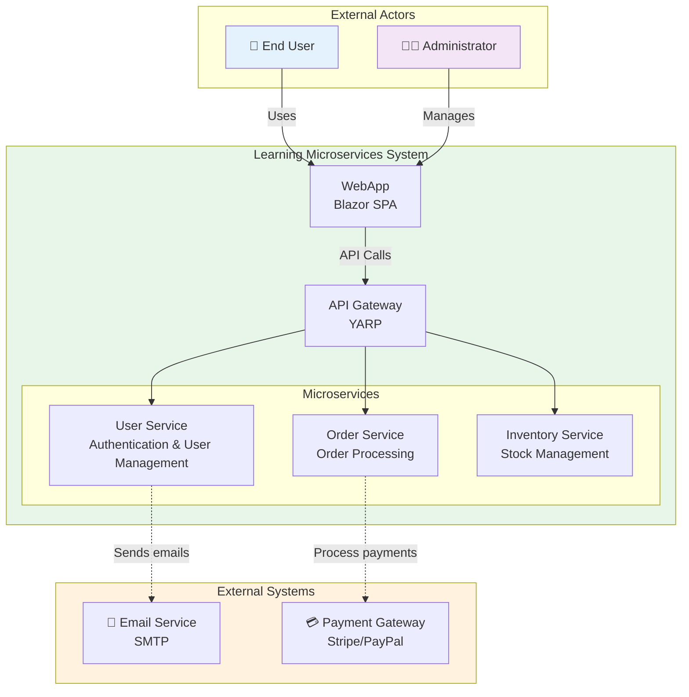

### C4 Model - Container Diagram

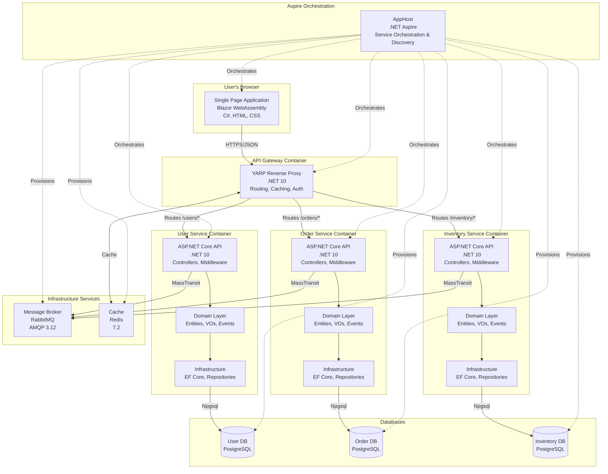

---

## Service Architecture

### Clean Architecture Layers

Each microservice follows the Clean Architecture pattern with the following layers:

```
Service/
├── API Layer (Presentation)
│   ├── Controllers
│   ├── Middlewares
│   └── Program.cs (DI, Configuration)
│
├── Contracts Layer
│   ├── DTOs (Data Transfer Objects)
│   ├── Requests
│   └── Responses
│
├── Domain Layer (Core Business Logic)
│   ├── Entities (Aggregates)
│   ├── Value Objects
│   ├── Domain Events
│   ├── Domain Exceptions
│   └── Repository Interfaces
│
└── Infrastructure Layer
    ├── DbContext
    ├── Entity Configurations (Fluent API)
    ├── Repository Implementations
    └── Migrations
```

### Dependency Flow

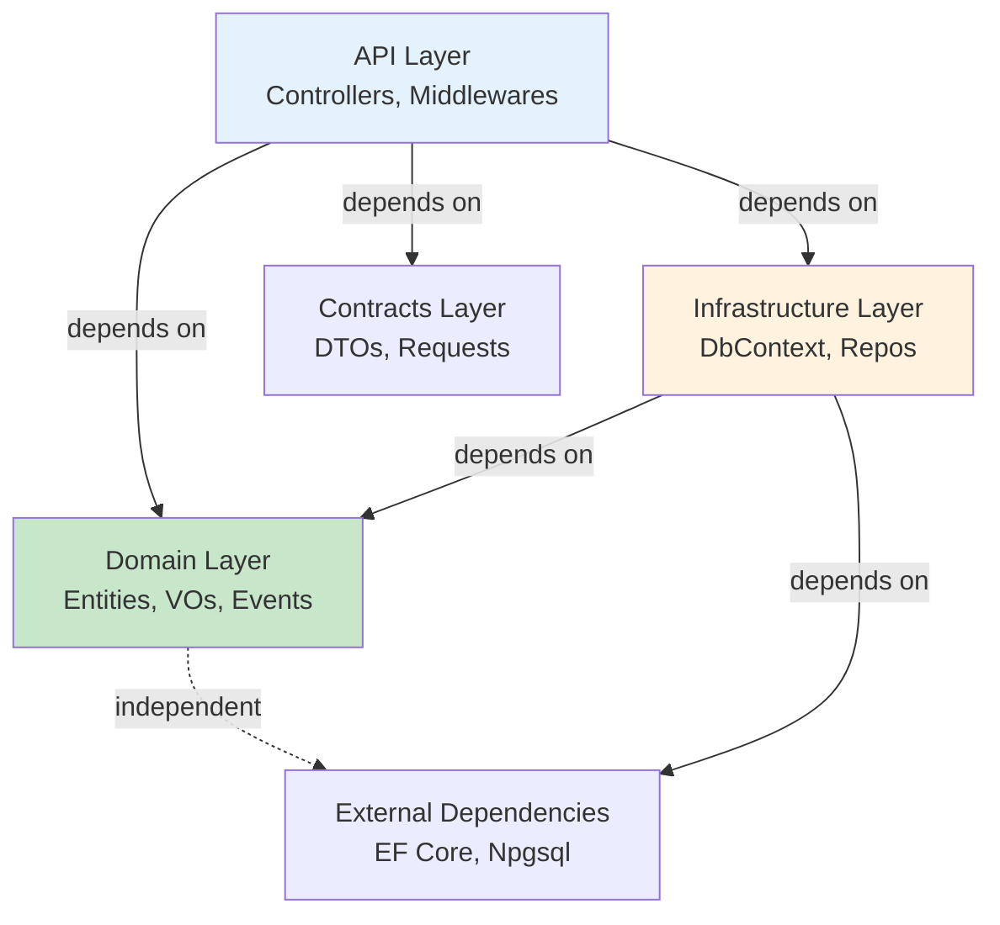

**Key Points:**
- Domain layer has **zero external dependencies**
- Infrastructure depends on Domain (not vice versa)
- API layer orchestrates between layers
- All dependencies point **inward** toward the domain

---

## Data Architecture

### Database Schema Strategy

Each microservice has its own PostgreSQL database following these conventions:

#### User Service Schema

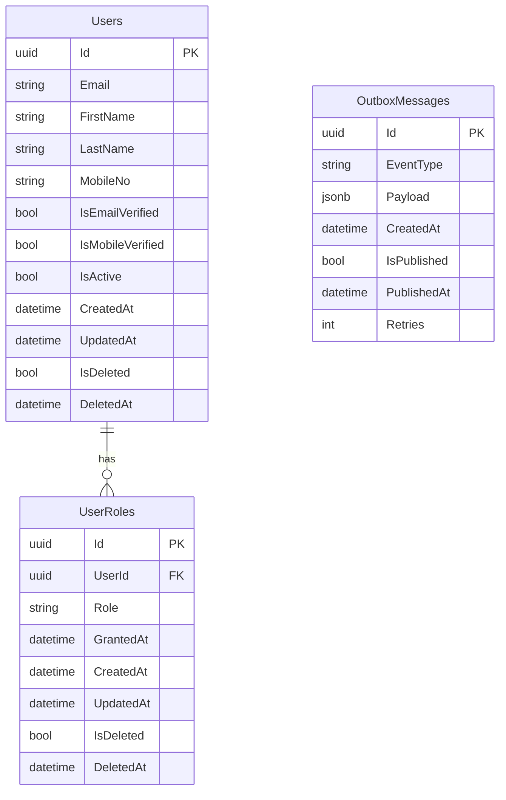

#### Shared Base Entity Pattern

All entities inherit from `BaseEntity<TId>` (defined in `Shared.Domain`):

```csharp
public abstract class BaseEntity<TId>
{
    public TId Id { get; protected set; } = default!;
    public DateTime CreatedAt { get; private set; } = DateTime.UtcNow;
    public DateTime? UpdatedAt { get; private set; }
    public bool IsDeleted { get; private set; }
    public DateTime? DeletedAt { get; private set; }
}
```

**Benefits:**
- Consistent ID generation (GUID v7)
- Automatic audit fields
- Built-in soft delete support
- Timestamp tracking

### Data Consistency Patterns

#### Transactional Consistency (Within Service)

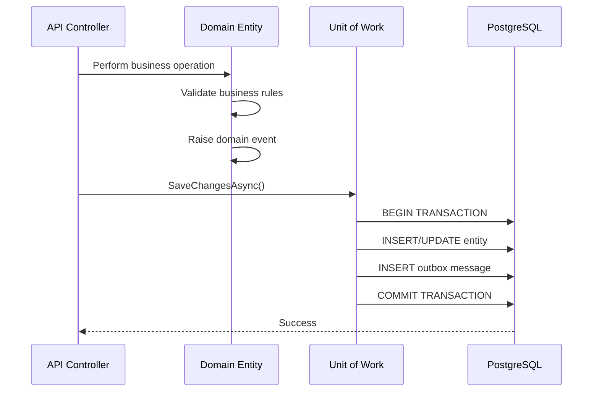

#### Eventual Consistency (Between Services)

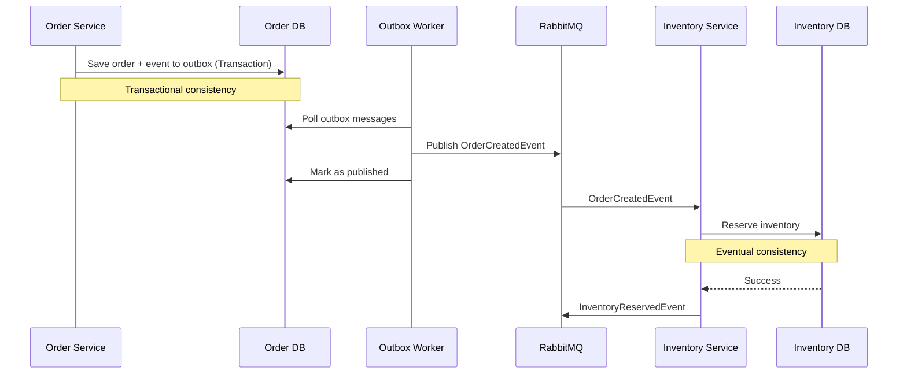

---

## Messaging Architecture

### Event Types

#### 1. Domain Events (Intra-Service)

**Purpose**: Communication within a single service
**Scope**: Internal to service
**Storage**: In-memory (cleared after processing)
**Example**: `UserEmailVerifiedEvent`

```csharp
// Raised within domain entity
public class UserEntity : GuidEntity
{
    public void VerifyEmail()
    {
        IsEmailVerified = true;
        Raise(new UserEmailVerifiedEvent(Id, Email));
    }
}

// Processed before SaveChanges
// Converted to OutboxMessage
```

#### 2. Integration Events (Inter-Service)

**Purpose**: Communication between services
**Scope**: Cross-service
**Storage**: RabbitMQ via MassTransit
**Example**: `OrderCreatedEvent`

```csharp
// Published to RabbitMQ
public record OrderCreatedEvent
{
    public Guid OrderId { get; init; }
    public Guid UserId { get; init; }
    public decimal TotalAmount { get; init; }
    public List<OrderItem> Items { get; init; }
}

// Consumed by InventoryService
public class OrderCreatedEventConsumer : IConsumer<OrderCreatedEvent>
{
    public async Task Consume(ConsumeContext<OrderCreatedEvent> context)
    {
        // Reserve inventory
    }
}
```

### Message Flow Architecture

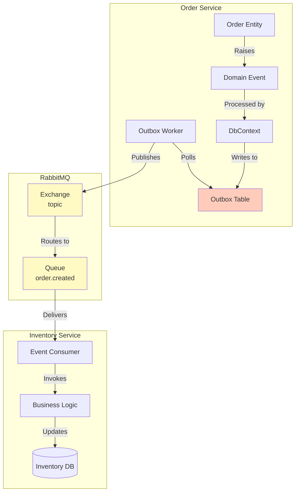

### Outbox Pattern Details

**Why Outbox Pattern?**
- Ensures **atomic** write to database + message queue
- Prevents message loss if MQ is down
- Enables **at-least-once** delivery semantics
- Allows retry logic for failed messages

**Outbox Message Schema:**

```csharp
public class OutboxMessage
{
    public Guid Id { get; set; }
    public string EventType { get; set; } // "OrderCreatedEvent"
    public string Payload { get; set; }   // JSON serialized event
    public DateTime CreatedAt { get; set; }
    public bool IsPublished { get; set; }
    public DateTime? PublishedAt { get; set; }
    public int Retries { get; set; }
}
```

---

## Infrastructure Architecture

### Shared Infrastructure Projects

#### 1. Infrastructure.Persistence

**Purpose**: Base persistence functionality for all services

**Contains:**
- `BaseDbContext` - Soft delete, audit fields, outbox integration
- `BaseRepository<TEntity, TId>` - Generic CRUD operations
- `OutboxMessage` entity
- Common EF Core configurations

**Usage:**
```csharp
public class UserDbContext : BaseDbContext
{
    protected override void OnModelCreating(ModelBuilder modelBuilder)
    {
        base.OnModelCreating(modelBuilder); // Applies soft delete filter
        modelBuilder.ApplyConfigurationsFromAssembly(Assembly.GetExecutingAssembly());
    }
}
```

#### 2. Infrastructure.Messaging

**Purpose**: MassTransit and RabbitMQ configuration

**Contains:**
- MassTransit setup
- RabbitMQ connection configuration
- Message serialization settings
- Retry policies

#### 3. Infrastructure.Exceptions

**Purpose**: Global exception handling

**Contains:**
- `GlobalExceptionHandler` middleware
- `DomainException` base class
- `NotFoundException`, `ValidationException`
- Problem Details factory

#### 4. Shared.Domain

**Purpose**: Core domain building blocks

**Contains:**
- `BaseEntity<TId>` - Entity base class
- `GuidEntity`, `LongEntity` - Convenience aliases
- `IDomainEvent` - Domain event marker interface
- `IBaseRepository<TEntity, TId>` - Repository contract
- `IUnitOfWork` - Unit of work pattern

### Service Discovery with Aspire

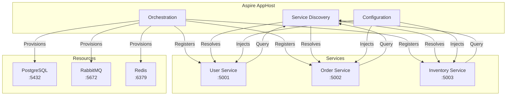

---

## Deployment Architecture

### Local Development (Aspire)

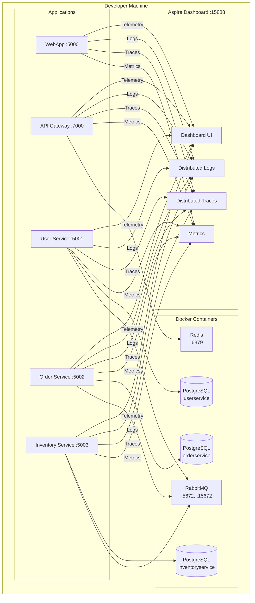

### Container Architecture (Future)

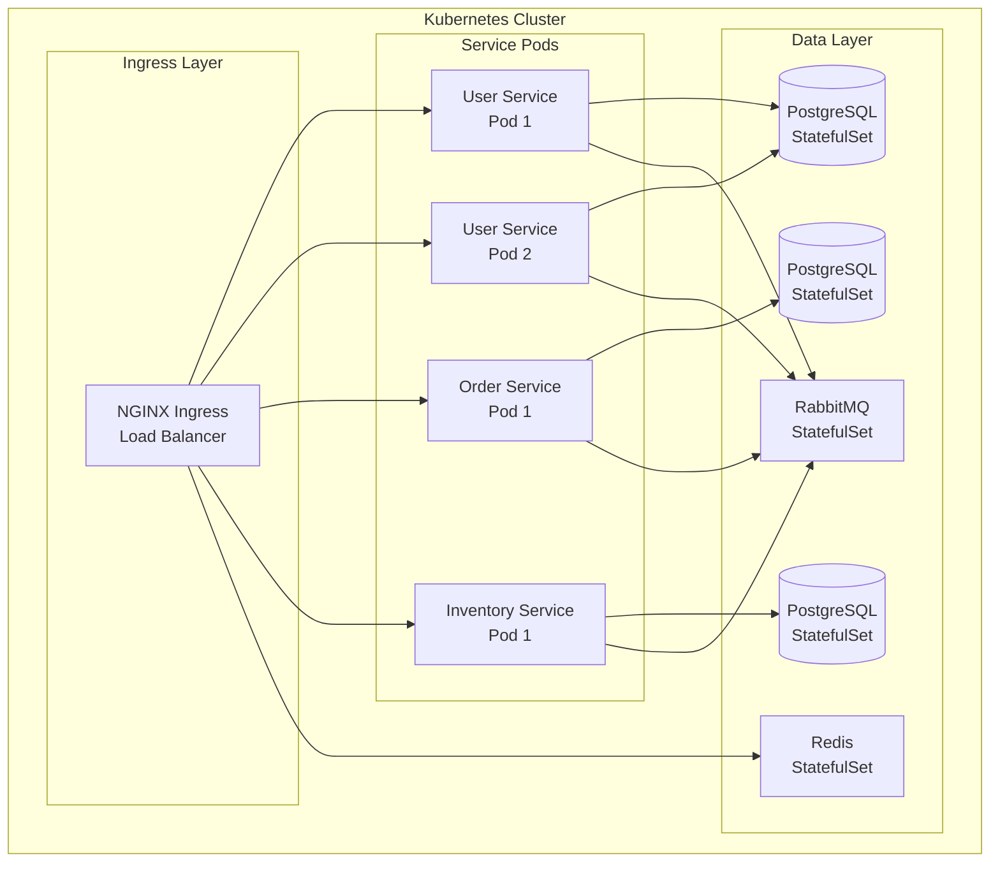

---

## Scalability Considerations

### Horizontal Scaling

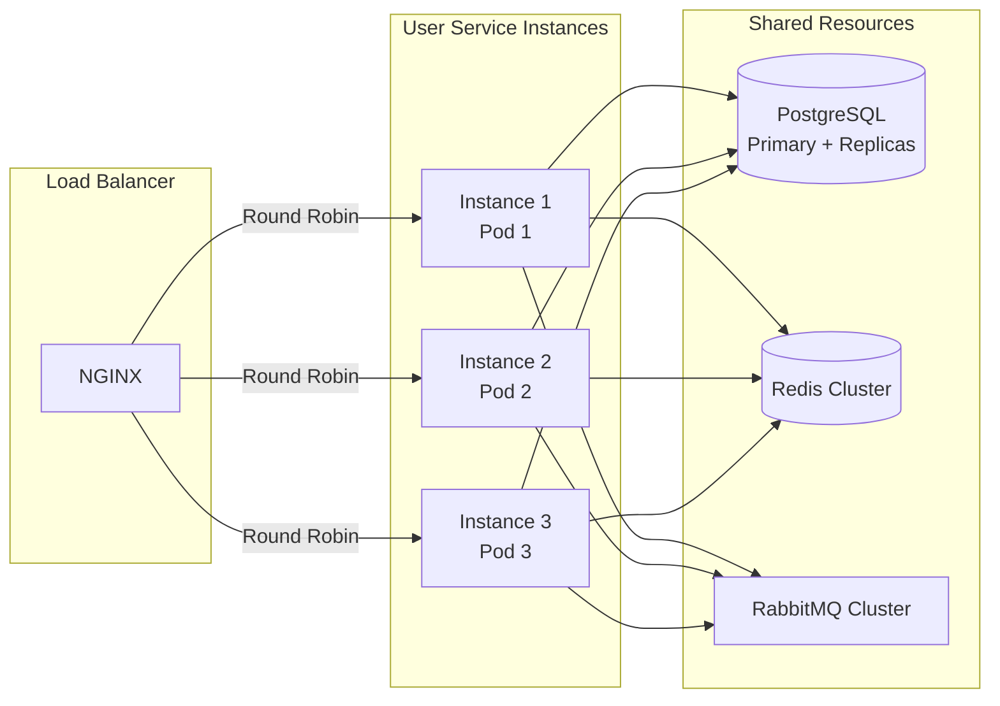

### Database Scaling

**Read Replicas:**
- Use PostgreSQL read replicas for read-heavy workloads
- CQRS pattern to separate read/write models

**Sharding (Future):**
- Shard by tenant ID or user ID
- Implement routing logic in repositories

**Caching Strategy:**
- L1 Cache: In-memory per service instance
- L2 Cache: Redis shared cache
- Cache invalidation via events

---

## Security Architecture

### Authentication Flow

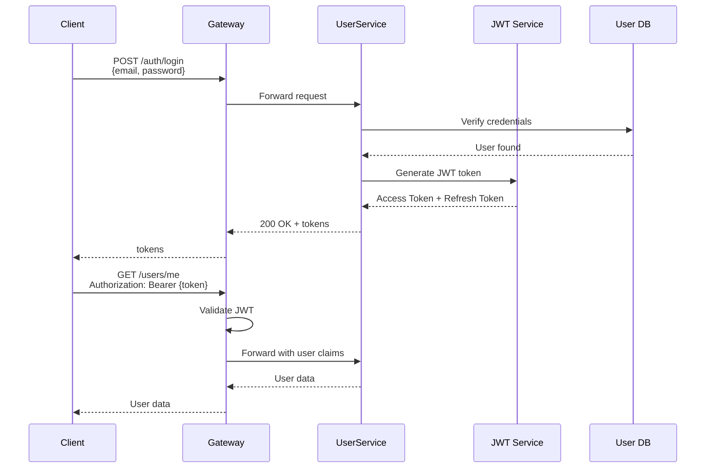

### Authorization Levels

1. **Gateway Level**: Rate limiting, IP filtering
2. **Service Level**: Role-based access control (RBAC)
3. **Domain Level**: Business rule validation

---

## Monitoring & Observability

### OpenTelemetry Integration

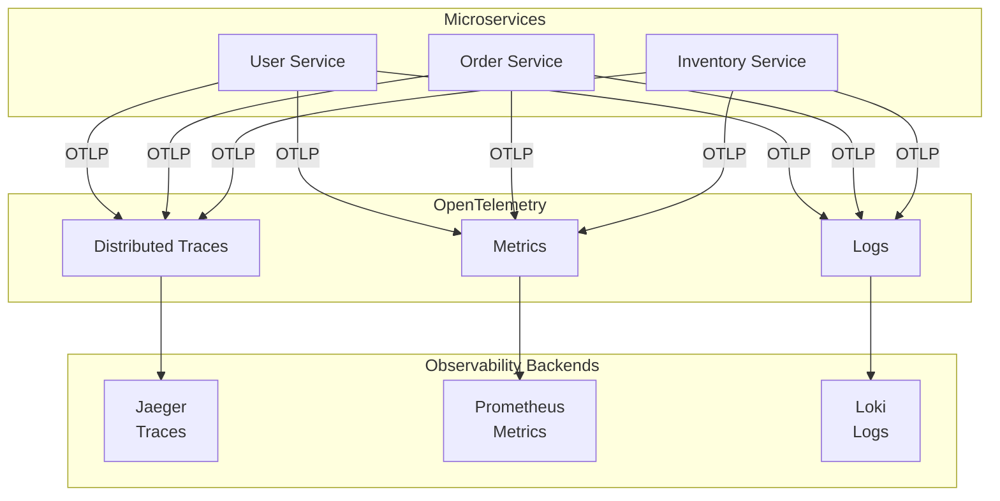

---

## Conclusion

This architecture provides:
- ✅ **Scalability** through microservices and horizontal scaling
- ✅ **Resilience** via outbox pattern and eventual consistency
- ✅ **Maintainability** through clean architecture and DDD
- ✅ **Observability** with OpenTelemetry and Aspire
- ✅ **Flexibility** to evolve services independently

For implementation details, refer to the code in the respective projects.
