# Architecture Diagrams Reference

This document contains all architecture diagrams for the Learning Microservices project.

---

## Table of Contents

1. [System Overview](#system-overview)
2. [Layer Architecture](#layer-architecture)
3. [Data Flow](#data-flow)
4. [Messaging Patterns](#messaging-patterns)
5. [Deployment Diagrams](#deployment-diagrams)

---

## System Overview

### Microservices Ecosystem

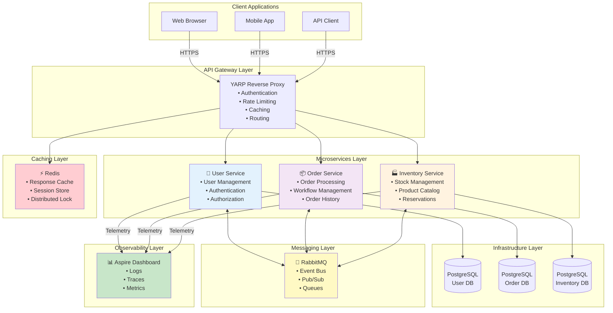
```mermaid
graph TB
    subgraph Client["Client Applications"]
        WEB[Web Browser]
        MOBILE[Mobile App]
        API_CLIENT[API Client]
    end

    subgraph Gateway["API Gateway Layer"]
        YARP[YARP Reverse Proxy<br/>• Authentication<br/>• Rate Limiting<br/>• Caching<br/>• Routing]
    end

    subgraph Services["Microservices Layer"]
        direction LR
        US["👤 User Service<br/>• User Management<br/>• Authentication<br/>• Authorization"]
        OS["📦 Order Service<br/>• Order Processing<br/>• Workflow Management<br/>• Order History"]
        IS["🏭 Inventory Service<br/>• Stock Management<br/>• Product Catalog<br/>• Reservations"]
    end

    subgraph Infrastructure["Infrastructure Layer"]
        direction LR
        PG1[("PostgreSQL<br/>User DB")]
        PG2[("PostgreSQL<br/>Order DB")]
        PG3[("PostgreSQL<br/>Inventory DB")]
    end

    subgraph Messaging["Messaging Layer"]
        RABBIT["🐰 RabbitMQ<br/>• Event Bus<br/>• Pub/Sub<br/>• Queues"]
    end

    subgraph Caching["Caching Layer"]
        REDIS["⚡ Redis<br/>• Response Cache<br/>• Session Store<br/>• Distributed Lock"]
    end

    subgraph Observability["Observability Layer"]
        ASPIRE["📊 Aspire Dashboard<br/>• Logs<br/>• Traces<br/>• Metrics"]
    end

    WEB & MOBILE & API_CLIENT -->|HTTPS| YARP
    YARP --> REDIS
    YARP --> US & OS & IS

    US --> PG1
    OS --> PG2
    IS --> PG3

    US & OS & IS <--> RABBIT
    US & OS & IS -->|Telemetry| ASPIRE

    style US fill:#e3f2fd
    style OS fill:#f3e5f5
    style IS fill:#fff3e0
    style RABBIT fill:#fff9c4
    style REDIS fill:#ffcdd2
    style ASPIRE fill:#c8e6c9
```

---

## Layer Architecture

### Clean Architecture - Detailed View

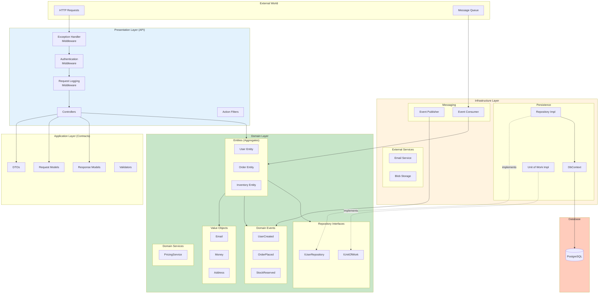
```mermaid
graph TB
    subgraph External["External World"]
        HTTP[HTTP Requests]
        MQ[Message Queue]
    end

    subgraph Presentation["Presentation Layer (API)"]
        direction TB
        MW1[Exception Handler<br/>Middleware]
        MW2[Authentication<br/>Middleware]
        MW3[Request Logging<br/>Middleware]
        CTRL[Controllers]
        FILTER[Action Filters]
    end

    subgraph Application["Application Layer (Contracts)"]
        direction TB
        DTO[DTOs]
        REQ[Request Models]
        RES[Response Models]
        VALID[Validators]
    end

    subgraph Domain["Domain Layer"]
        direction TB
        
        subgraph Entities["Entities (Aggregates)"]
            ENT1[User Entity]
            ENT2[Order Entity]
            ENT3[Inventory Entity]
        end

        subgraph ValueObjects["Value Objects"]
            VO1[Email]
            VO2[Money]
            VO3[Address]
        end

        subgraph Events["Domain Events"]
            EVT1[UserCreated]
            EVT2[OrderPlaced]
            EVT3[StockReserved]
        end

        subgraph Interfaces["Repository Interfaces"]
            IREPO[IUserRepository]
            IUOW[IUnitOfWork]
        end

        subgraph DomainServices["Domain Services"]
            DSVC[PricingService]
        end
    end

    subgraph Infrastructure["Infrastructure Layer"]
        direction TB
        
        subgraph Persistence["Persistence"]
            CTX[DbContext]
            REPO[Repository Impl]
            UOW[Unit of Work Impl]
        end

        subgraph External_Services["External Services"]
            EMAIL[Email Service]
            STORAGE[Blob Storage]
        end

        subgraph Messaging_Infra["Messaging"]
            PUB[Event Publisher]
            CONS[Event Consumer]
        end
    end

    subgraph Database["Database"]
        DB[(PostgreSQL)]
    end

    HTTP --> MW1 --> MW2 --> MW3 --> CTRL
    MQ --> CONS
    CTRL --> DTO & REQ
    CTRL --> Entities
    CONS --> Entities

    Entities --> ValueObjects
    Entities --> Events
    Entities --> Interfaces

    REPO -.implements.-> IREPO
    UOW -.implements.-> IUOW
    CTX --> DB
    REPO --> CTX

    PUB --> Events
    CTRL --> RES

    style Domain fill:#c8e6c9
    style Presentation fill:#e3f2fd
    style Infrastructure fill:#fff3e0
    style Database fill:#ffccbc
```

---

## Data Flow

### Request/Response Flow

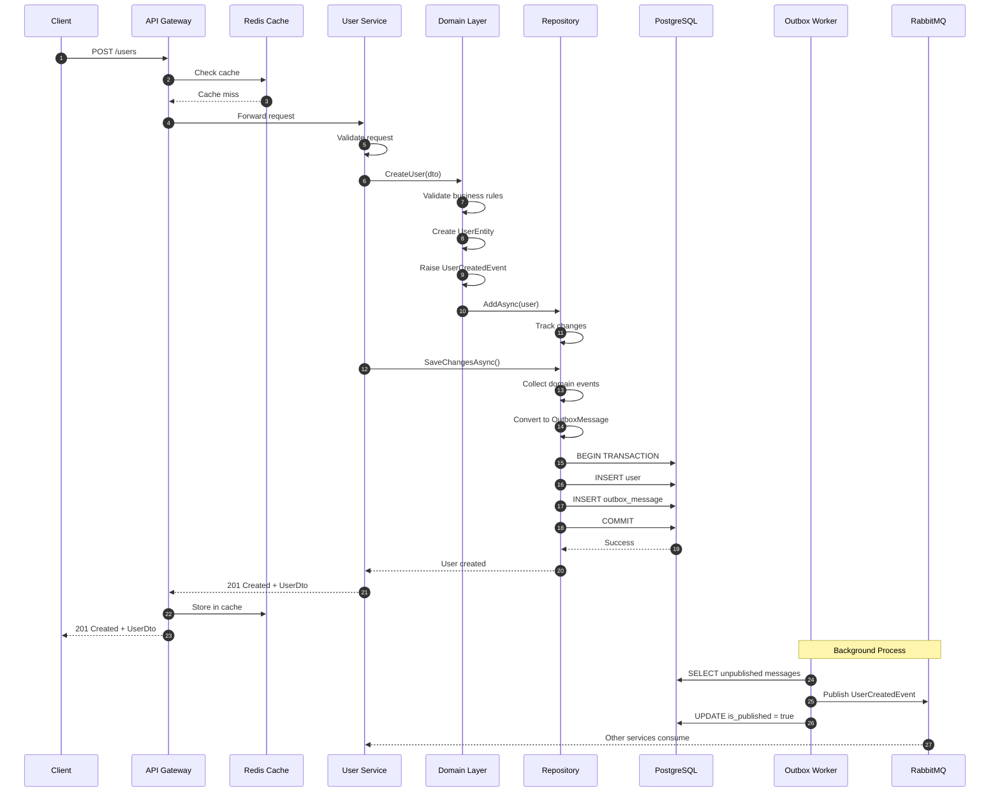
```mermaid
sequenceDiagram
    autonumber
    participant Client
    participant Gateway as API Gateway
    participant Cache as Redis Cache
    participant Service as User Service
    participant Domain as Domain Layer
    participant Repo as Repository
    participant DB as PostgreSQL
    participant Outbox as Outbox Worker
    participant MQ as RabbitMQ

    Client->>Gateway: POST /users
    Gateway->>Cache: Check cache
    Cache-->>Gateway: Cache miss
    
    Gateway->>Service: Forward request
    Service->>Service: Validate request
    Service->>Domain: CreateUser(dto)
    
    Domain->>Domain: Validate business rules
    Domain->>Domain: Create UserEntity
    Domain->>Domain: Raise UserCreatedEvent
    
    Domain->>Repo: AddAsync(user)
    Repo->>Repo: Track changes
    Service->>Repo: SaveChangesAsync()
    
    Repo->>Repo: Collect domain events
    Repo->>Repo: Convert to OutboxMessage
    Repo->>DB: BEGIN TRANSACTION
    Repo->>DB: INSERT user
    Repo->>DB: INSERT outbox_message
    Repo->>DB: COMMIT
    DB-->>Repo: Success
    
    Repo-->>Service: User created
    Service-->>Gateway: 201 Created + UserDto
    Gateway->>Cache: Store in cache
    Gateway-->>Client: 201 Created + UserDto
    
    Note over Outbox,MQ: Background Process
    Outbox->>DB: SELECT unpublished messages
    Outbox->>MQ: Publish UserCreatedEvent
    Outbox->>DB: UPDATE is_published = true
    
    MQ-->>Service: Other services consume
```

### CQRS Pattern (Future Enhancement)

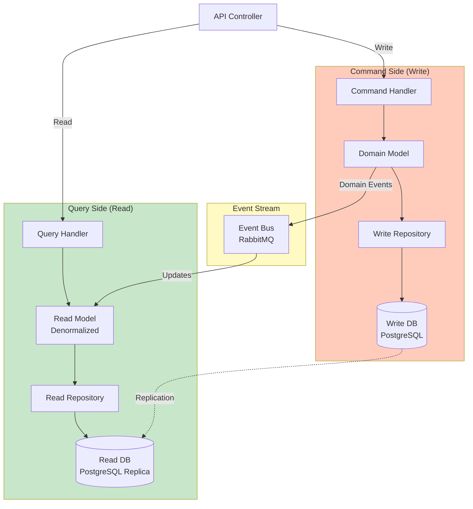
```mermaid
graph TB
    subgraph Commands["Command Side (Write)"]
        CMD[Command Handler]
        DOM_W[Domain Model]
        REPO_W[Write Repository]
        DB_W[(Write DB<br/>PostgreSQL)]
    end

    subgraph Queries["Query Side (Read)"]
        QRY[Query Handler]
        READ_MODEL[Read Model<br/>Denormalized]
        REPO_R[Read Repository]
        DB_R[(Read DB<br/>PostgreSQL Replica)]
    end

    subgraph Events["Event Stream"]
        EVT_BUS[Event Bus<br/>RabbitMQ]
    end

    API[API Controller]
    
    API -->|Write| CMD
    API -->|Read| QRY
    
    CMD --> DOM_W
    DOM_W --> REPO_W
    REPO_W --> DB_W
    
    QRY --> READ_MODEL
    READ_MODEL --> REPO_R
    REPO_R --> DB_R
    
    DOM_W -->|Domain Events| EVT_BUS
    EVT_BUS -->|Updates| READ_MODEL
    
    DB_W -.->|Replication| DB_R

    style Commands fill:#ffccbc
    style Queries fill:#c8e6c9
    style Events fill:#fff9c4
```

---

## Messaging Patterns

### Pub/Sub Pattern

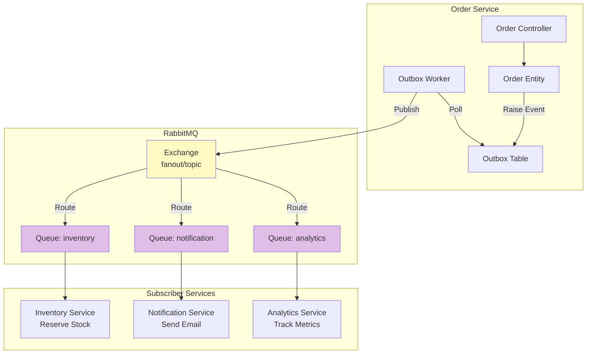
```mermaid
graph TB
    subgraph Publisher["Order Service"]
        PUB[Order Controller]
        DOMAIN[Order Entity]
        OUTBOX[Outbox Table]
        WORKER[Outbox Worker]
    end

    subgraph Broker["RabbitMQ"]
        EXCHANGE[Exchange<br/>fanout/topic]
        Q1[Queue: inventory]
        Q2[Queue: notification]
        Q3[Queue: analytics]
    end

    subgraph Subscribers["Subscriber Services"]
        SUB1[Inventory Service<br/>Reserve Stock]
        SUB2[Notification Service<br/>Send Email]
        SUB3[Analytics Service<br/>Track Metrics]
    end

    PUB --> DOMAIN
    DOMAIN -->|Raise Event| OUTBOX
    WORKER -->|Poll| OUTBOX
    WORKER -->|Publish| EXCHANGE
    
    EXCHANGE -->|Route| Q1
    EXCHANGE -->|Route| Q2
    EXCHANGE -->|Route| Q3
    
    Q1 --> SUB1
    Q2 --> SUB2
    Q3 --> SUB3

    style EXCHANGE fill:#fff9c4
    style Q1 fill:#e1bee7
    style Q2 fill:#e1bee7
    style Q3 fill:#e1bee7
```

### Saga Pattern (Planned)

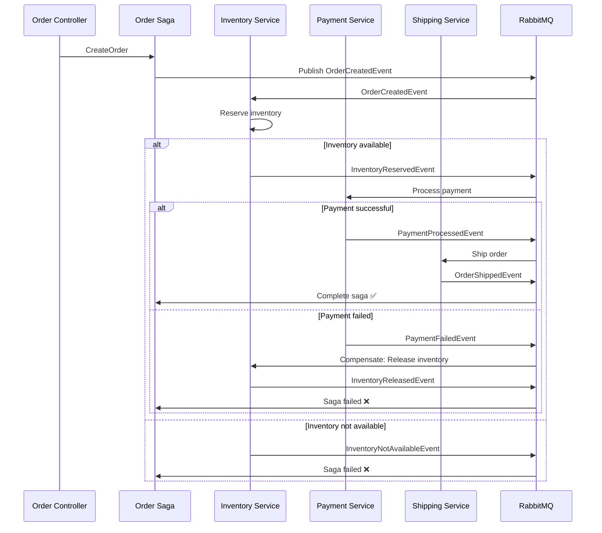
```mermaid
sequenceDiagram
    participant OC as Order Controller
    participant OS as Order Saga
    participant IS as Inventory Service
    participant PS as Payment Service
    participant SS as Shipping Service
    participant MQ as RabbitMQ

    OC->>OS: CreateOrder
    OS->>MQ: Publish OrderCreatedEvent
    
    MQ->>IS: OrderCreatedEvent
    IS->>IS: Reserve inventory
    
    alt Inventory available
        IS->>MQ: InventoryReservedEvent
        MQ->>PS: Process payment
        
        alt Payment successful
            PS->>MQ: PaymentProcessedEvent
            MQ->>SS: Ship order
            SS->>MQ: OrderShippedEvent
            MQ->>OS: Complete saga ✅
        else Payment failed
            PS->>MQ: PaymentFailedEvent
            MQ->>IS: Compensate: Release inventory
            IS->>MQ: InventoryReleasedEvent
            MQ->>OS: Saga failed ❌
        end
    else Inventory not available
        IS->>MQ: InventoryNotAvailableEvent
        MQ->>OS: Saga failed ❌
    end
```

### Event Sourcing (Planned)

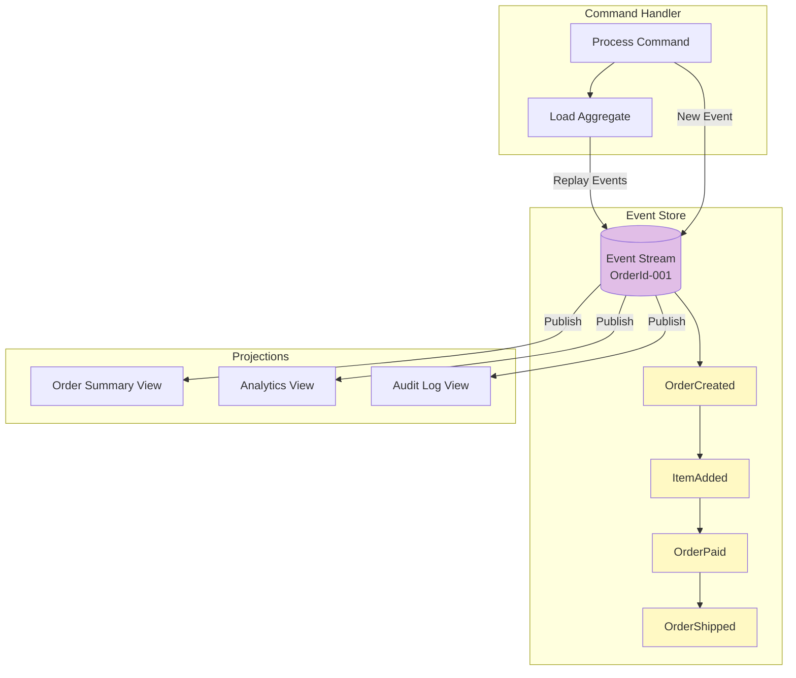
```mermaid
graph TB
    subgraph Command["Command Handler"]
        CMD[Process Command]
        AGG[Load Aggregate]
    end

    subgraph EventStore["Event Store"]
        ES[(Event Stream<br/>OrderId-001)]
        EVT1[OrderCreated]
        EVT2[ItemAdded]
        EVT3[OrderPaid]
        EVT4[OrderShipped]
    end

    subgraph Projection["Projections"]
        PROJ1[Order Summary View]
        PROJ2[Analytics View]
        PROJ3[Audit Log View]
    end

    CMD --> AGG
    AGG -->|Replay Events| ES
    ES --> EVT1 --> EVT2 --> EVT3 --> EVT4
    
    CMD -->|New Event| ES
    ES -->|Publish| PROJ1 & PROJ2 & PROJ3

    style ES fill:#e1bee7
    style EVT1 fill:#fff9c4
    style EVT2 fill:#fff9c4
    style EVT3 fill:#fff9c4
    style EVT4 fill:#fff9c4
```

---

## Deployment Diagrams

### Local Development with Aspire

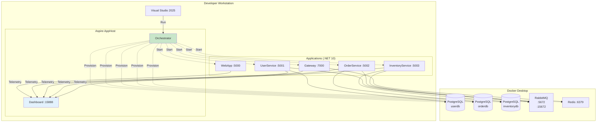
```mermaid
graph TB
    subgraph Developer["Developer Workstation"]
        IDE[Visual Studio 2025]
        
        subgraph Aspire["Aspire AppHost"]
            DASH[Dashboard :15888]
            ORCH[Orchestrator]
        end

        subgraph Apps["Applications (.NET 10)"]
            direction LR
            WEBAPP[WebApp :5000]
            GW[Gateway :7000]
            US[UserService :5001]
            OS[OrderService :5002]
            IS[InventoryService :5003]
        end
    end

    subgraph Docker["Docker Desktop"]
        PG_U[(PostgreSQL<br/>userdb)]
        PG_O[(PostgreSQL<br/>orderdb)]
        PG_I[(PostgreSQL<br/>inventorydb)]
        RABBIT[RabbitMQ<br/>:5672<br/>:15672]
        REDIS[Redis :6379]
    end

    IDE -->|Run| ORCH
    ORCH -.->|Start| WEBAPP & GW & US & OS & IS
    ORCH -.->|Provision| PG_U & PG_O & PG_I & RABBIT & REDIS
    
    WEBAPP & GW & US & OS & IS -->|Telemetry| DASH
    
    US --> PG_U
    OS --> PG_O
    IS --> PG_I
    US & OS & IS --> RABBIT
    GW --> REDIS

    style ORCH fill:#c8e6c9
    style DASH fill:#e3f2fd
```

### Docker Compose Deployment

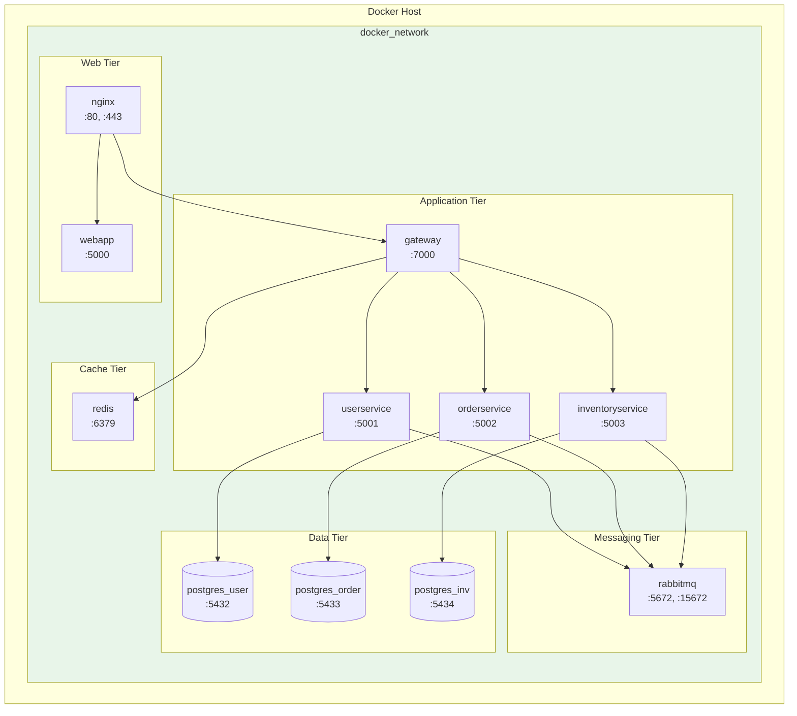
```mermaid
graph TB
    subgraph Host["Docker Host"]
        subgraph Network["docker_network"]
            direction TB
            
            subgraph WebTier["Web Tier"]
                NGINX[nginx<br/>:80, :443]
                WEB[webapp<br/>:5000]
            end

            subgraph AppTier["Application Tier"]
                GW[gateway<br/>:7000]
                US[userservice<br/>:5001]
                OS[orderservice<br/>:5002]
                IS[inventoryservice<br/>:5003]
            end

            subgraph DataTier["Data Tier"]
                PG_U[(postgres_user<br/>:5432)]
                PG_O[(postgres_order<br/>:5433)]
                PG_I[(postgres_inv<br/>:5434)]
            end

            subgraph MsgTier["Messaging Tier"]
                RABBIT[rabbitmq<br/>:5672, :15672]
            end

            subgraph CacheTier["Cache Tier"]
                REDIS[redis<br/>:6379]
            end
        end
    end

    NGINX --> WEB
    NGINX --> GW
    GW --> US & OS & IS
    US --> PG_U
    OS --> PG_O
    IS --> PG_I
    US & OS & IS --> RABBIT
    GW --> REDIS

    style Network fill:#e8f5e9
```

### Kubernetes Deployment (Planned)

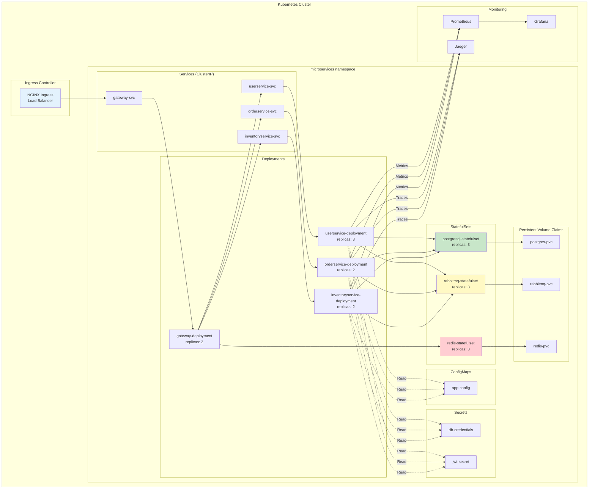
```mermaid
graph TB
    subgraph Cluster["Kubernetes Cluster"]
        subgraph Ingress["Ingress Controller"]
            ING[NGINX Ingress<br/>Load Balancer]
        end

        subgraph Namespace["microservices namespace"]
            subgraph Deployments["Deployments"]
                GW_DEP[gateway-deployment<br/>replicas: 2]
                US_DEP[userservice-deployment<br/>replicas: 3]
                OS_DEP[orderservice-deployment<br/>replicas: 2]
                IS_DEP[inventoryservice-deployment<br/>replicas: 2]
            end

            subgraph Services["Services (ClusterIP)"]
                GW_SVC[gateway-svc]
                US_SVC[userservice-svc]
                OS_SVC[orderservice-svc]
                IS_SVC[inventoryservice-svc]
            end

            subgraph StatefulSets["StatefulSets"]
                PG_SS[postgresql-statefulset<br/>replicas: 3]
                RABBIT_SS[rabbitmq-statefulset<br/>replicas: 3]
                REDIS_SS[redis-statefulset<br/>replicas: 3]
            end

            subgraph PVC["Persistent Volume Claims"]
                PG_PVC[postgres-pvc]
                RABBIT_PVC[rabbitmq-pvc]
                REDIS_PVC[redis-pvc]
            end

            subgraph ConfigMaps["ConfigMaps"]
                CONFIG[app-config]
            end

            subgraph Secrets["Secrets"]
                DB_SECRET[db-credentials]
                JWT_SECRET[jwt-secret]
            end
        end

        subgraph Monitoring["Monitoring"]
            PROM[Prometheus]
            GRAF[Grafana]
            JAEGER[Jaeger]
        end
    end

    ING --> GW_SVC
    GW_SVC --> GW_DEP
    GW_DEP --> US_SVC & OS_SVC & IS_SVC
    
    US_SVC --> US_DEP
    OS_SVC --> OS_DEP
    IS_SVC --> IS_DEP

    US_DEP & OS_DEP & IS_DEP --> PG_SS
    US_DEP & OS_DEP & IS_DEP --> RABBIT_SS
    GW_DEP --> REDIS_SS

    PG_SS --> PG_PVC
    RABBIT_SS --> RABBIT_PVC
    REDIS_SS --> REDIS_PVC

    US_DEP & OS_DEP & IS_DEP -.->|Read| CONFIG
    US_DEP & OS_DEP & IS_DEP -.->|Read| DB_SECRET & JWT_SECRET

    US_DEP & OS_DEP & IS_DEP -->|Metrics| PROM
    PROM --> GRAF
    US_DEP & OS_DEP & IS_DEP -->|Traces| JAEGER

    style ING fill:#e3f2fd
    style PG_SS fill:#c8e6c9
    style RABBIT_SS fill:#fff9c4
    style REDIS_SS fill:#ffcdd2
```

---

## Network & Communication

### Service Mesh (Future - Istio)

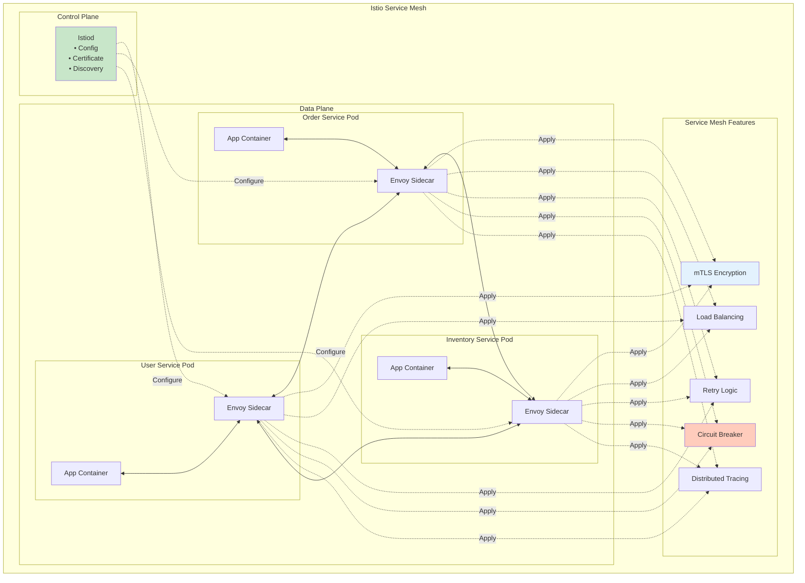
```mermaid
graph TB
    subgraph ServiceMesh["Istio Service Mesh"]
        subgraph ControlPlane["Control Plane"]
            ISTIOD[Istiod<br/>• Config<br/>• Certificate<br/>• Discovery]
        end

        subgraph DataPlane["Data Plane"]
            subgraph Pod1["User Service Pod"]
                US_APP[App Container]
                US_PROXY[Envoy Sidecar]
            end

            subgraph Pod2["Order Service Pod"]
                OS_APP[App Container]
                OS_PROXY[Envoy Sidecar]
            end

            subgraph Pod3["Inventory Service Pod"]
                IS_APP[App Container]
                IS_PROXY[Envoy Sidecar]
            end
        end

        subgraph Features["Service Mesh Features"]
            MTLS[mTLS Encryption]
            LB[Load Balancing]
            RETRY[Retry Logic]
            CB[Circuit Breaker]
            TRACE[Distributed Tracing]
        end
    end

    ISTIOD -.->|Configure| US_PROXY & OS_PROXY & IS_PROXY

    US_APP <--> US_PROXY
    OS_APP <--> OS_PROXY
    IS_APP <--> IS_PROXY

    US_PROXY <--> OS_PROXY
    OS_PROXY <--> IS_PROXY
    IS_PROXY <--> US_PROXY

    US_PROXY & OS_PROXY & IS_PROXY -.->|Apply| MTLS & LB & RETRY & CB & TRACE

    style ISTIOD fill:#c8e6c9
    style MTLS fill:#e3f2fd
    style CB fill:#ffccbc
```

### API Gateway Routing

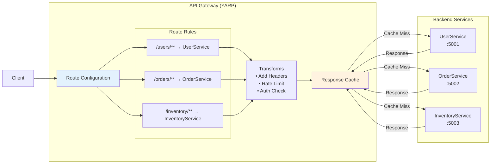
```mermaid
graph LR
    CLIENT[Client]
    
    subgraph Gateway["API Gateway (YARP)"]
        ROUTES[Route Configuration]
        
        subgraph Routes["Route Rules"]
            R1["/users/** → UserService"]
            R2["/orders/** → OrderService"]
            R3["/inventory/** → InventoryService"]
        end
        
        TRANSFORMS[Transforms<br/>• Add Headers<br/>• Rate Limit<br/>• Auth Check]
        CACHE[Response Cache]
    end

    subgraph Services["Backend Services"]
        US[UserService<br/>:5001]
        OS[OrderService<br/>:5002]
        IS[InventoryService<br/>:5003]
    end

    CLIENT --> ROUTES
    ROUTES --> R1 & R2 & R3
    R1 & R2 & R3 --> TRANSFORMS
    TRANSFORMS --> CACHE
    CACHE -->|Cache Miss| US & OS & IS
    US & OS & IS -->|Response| CACHE

    style ROUTES fill:#e3f2fd
    style CACHE fill:#fff3e0
```

---

## Observability

### Distributed Tracing

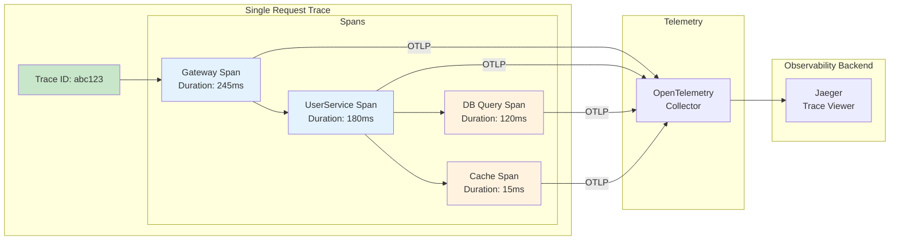
```mermaid
graph LR
    subgraph Request["Single Request Trace"]
        T0[Trace ID: abc123]
        
        subgraph Spans["Spans"]
            S1[Gateway Span<br/>Duration: 245ms]
            S2[UserService Span<br/>Duration: 180ms]
            S3[DB Query Span<br/>Duration: 120ms]
            S4[Cache Span<br/>Duration: 15ms]
        end
    end

    subgraph Collectors["Telemetry"]
        OTEL[OpenTelemetry<br/>Collector]
    end

    subgraph Backend["Observability Backend"]
        JAEGER[Jaeger<br/>Trace Viewer]
    end

    T0 --> S1
    S1 --> S2
    S2 --> S3
    S2 --> S4
    
    S1 & S2 & S3 & S4 -->|OTLP| OTEL
    OTEL --> JAEGER

    style T0 fill:#c8e6c9
    style S1 fill:#e3f2fd
    style S2 fill:#e3f2fd
    style S3 fill:#fff3e0
    style S4 fill:#fff3e0
```

### Metrics Collection

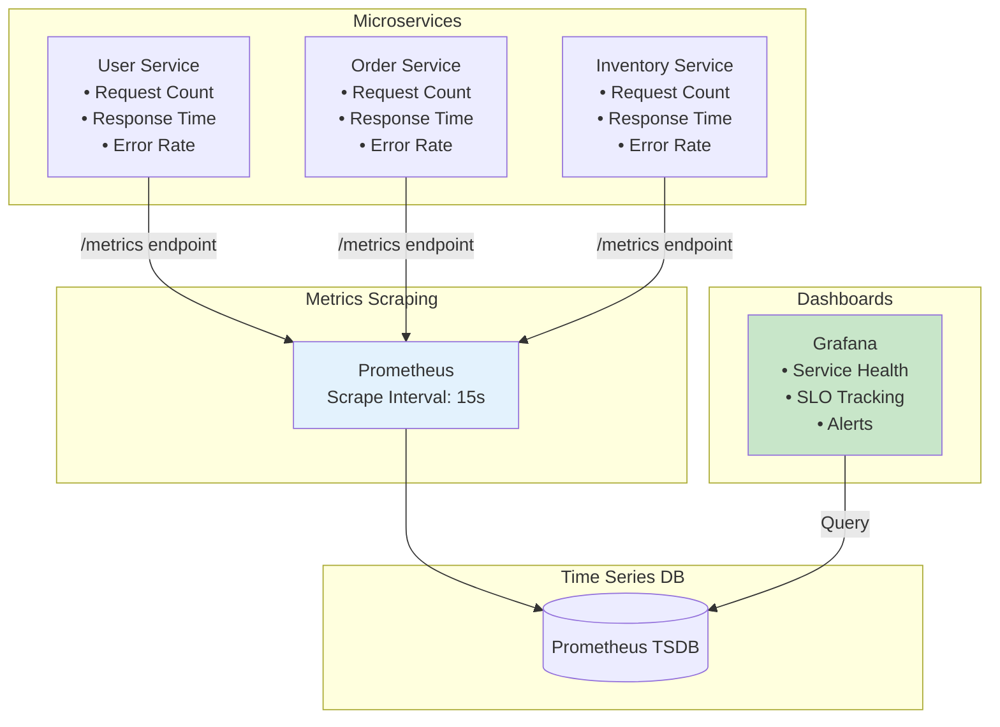
```mermaid
graph TB
    subgraph Services["Microservices"]
        US[User Service<br/>• Request Count<br/>• Response Time<br/>• Error Rate]
        OS[Order Service<br/>• Request Count<br/>• Response Time<br/>• Error Rate]
        IS[Inventory Service<br/>• Request Count<br/>• Response Time<br/>• Error Rate]
    end

    subgraph Scraping["Metrics Scraping"]
        PROM[Prometheus<br/>Scrape Interval: 15s]
    end

    subgraph Storage["Time Series DB"]
        TSDB[(Prometheus TSDB)]
    end

    subgraph Visualization["Dashboards"]
        GRAF[Grafana<br/>• Service Health<br/>• SLO Tracking<br/>• Alerts]
    end

    US & OS & IS -->|/metrics endpoint| PROM
    PROM --> TSDB
    GRAF -->|Query| TSDB

    style PROM fill:#e3f2fd
    style GRAF fill:#c8e6c9
```

---

## Error Handling

### Exception Flow

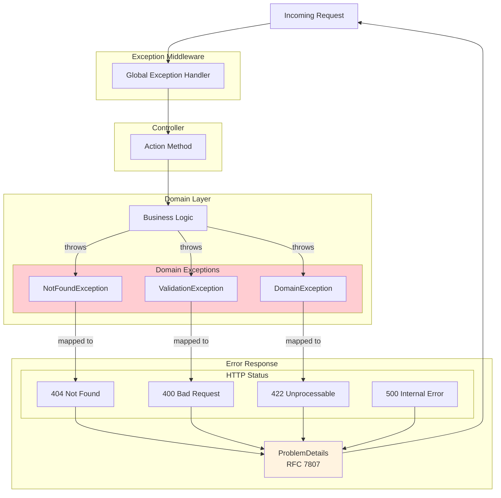
```mermaid
graph TB
    REQ[Incoming Request]
    
    subgraph Middleware["Exception Middleware"]
        HANDLER[Global Exception Handler]
    end

    subgraph Controller["Controller"]
        ACTION[Action Method]
    end

    subgraph Domain["Domain Layer"]
        LOGIC[Business Logic]
        
        subgraph Exceptions["Domain Exceptions"]
            NOT_FOUND[NotFoundException]
            VALIDATION[ValidationException]
            DOMAIN_EX[DomainException]
        end
    end

    subgraph Response["Error Response"]
        PROBLEM[ProblemDetails<br/>RFC 7807]
        
        subgraph StatusCodes["HTTP Status"]
            S404[404 Not Found]
            S400[400 Bad Request]
            S422[422 Unprocessable]
            S500[500 Internal Error]
        end
    end

    REQ --> HANDLER
    HANDLER --> ACTION
    ACTION --> LOGIC
    
    LOGIC -->|throws| NOT_FOUND
    LOGIC -->|throws| VALIDATION
    LOGIC -->|throws| DOMAIN_EX
    
    NOT_FOUND -->|mapped to| S404
    VALIDATION -->|mapped to| S400
    DOMAIN_EX -->|mapped to| S422
    
    S404 & S400 & S422 & S500 --> PROBLEM
    PROBLEM --> REQ

    style Exceptions fill:#ffcdd2
    style PROBLEM fill:#fff3e0
```

---

## Database Patterns

### Repository Pattern

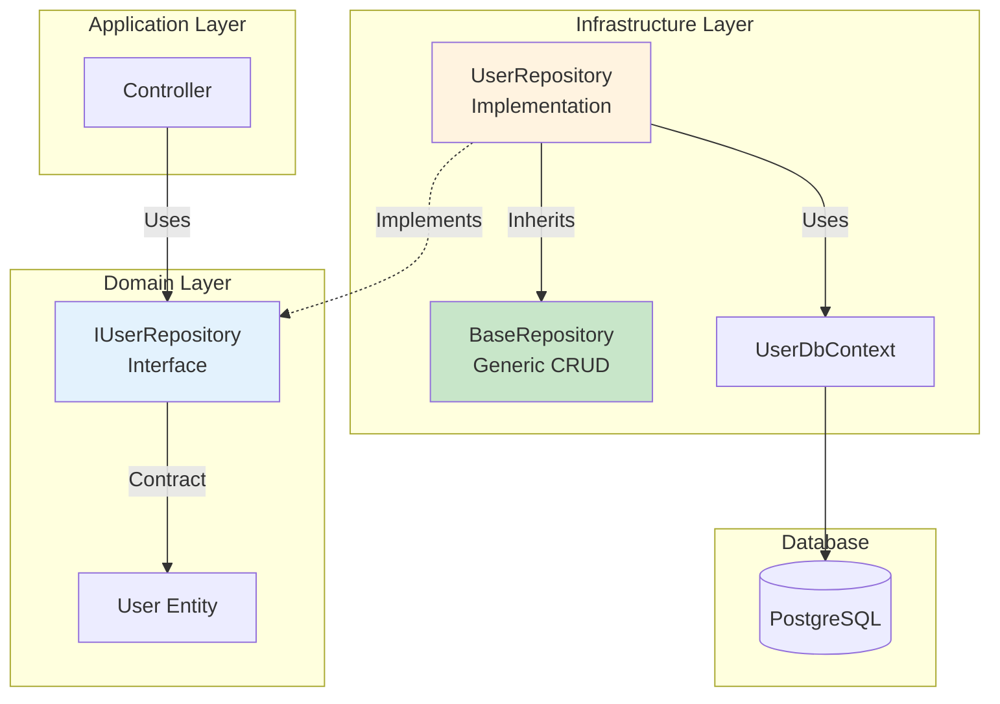
```mermaid
graph TB
    subgraph Application["Application Layer"]
        CTRL[Controller]
    end

    subgraph Domain["Domain Layer"]
        INTF[IUserRepository<br/>Interface]
        ENT[User Entity]
    end

    subgraph Infrastructure["Infrastructure Layer"]
        REPO[UserRepository<br/>Implementation]
        BASE[BaseRepository<T,TId><br/>Generic CRUD]
        CTX[UserDbContext]
    end

    subgraph Database["Database"]
        DB[(PostgreSQL)]
    end

    CTRL -->|Uses| INTF
    INTF -->|Contract| ENT
    REPO -.->|Implements| INTF
    REPO -->|Inherits| BASE
    REPO -->|Uses| CTX
    CTX --> DB

    style INTF fill:#e3f2fd
    style REPO fill:#fff3e0
    style BASE fill:#c8e6c9
```

### Unit of Work Pattern

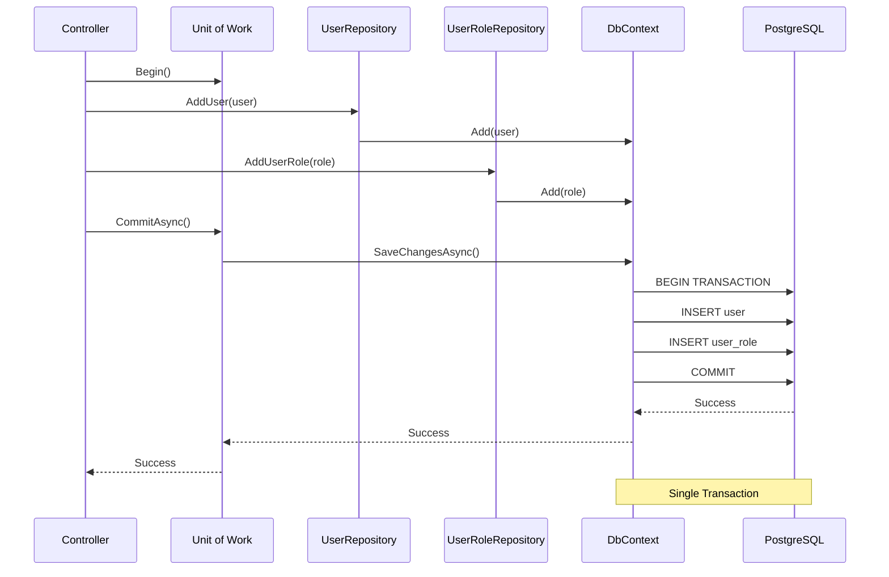
```mermaid
sequenceDiagram
    participant Ctrl as Controller
    participant UOW as Unit of Work
    participant Repo1 as UserRepository
    participant Repo2 as UserRoleRepository
    participant Ctx as DbContext
    participant DB as PostgreSQL

    Ctrl->>UOW: Begin()
    Ctrl->>Repo1: AddUser(user)
    Repo1->>Ctx: Add(user)
    Ctrl->>Repo2: AddUserRole(role)
    Repo2->>Ctx: Add(role)
    
    Ctrl->>UOW: CommitAsync()
    UOW->>Ctx: SaveChangesAsync()
    Ctx->>DB: BEGIN TRANSACTION
    Ctx->>DB: INSERT user
    Ctx->>DB: INSERT user_role
    Ctx->>DB: COMMIT
    DB-->>Ctx: Success
    Ctx-->>UOW: Success
    UOW-->>Ctrl: Success

    Note over Ctx,DB: Single Transaction
```

---

## Diagram Legend

### Node Types

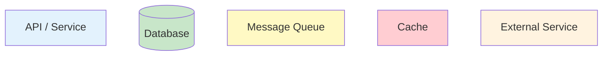
```mermaid
graph TB
    API[API / Service]
    DB[(Database)]
    Q[Message Queue]
    CACHE[Cache]
    EXT[External Service]

    style API fill:#e3f2fd
    style DB fill:#c8e6c9
    style Q fill:#fff9c4
    style CACHE fill:#ffcdd2
    style EXT fill:#fff3e0
```

### Relationship Types

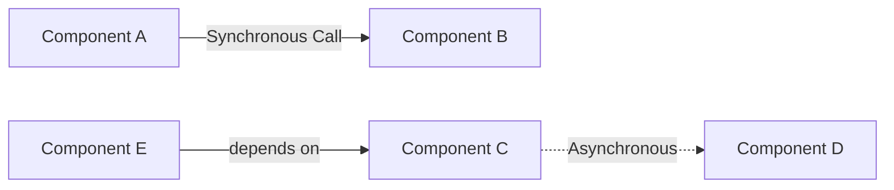
```mermaid
graph LR
    A[Component A]
    B[Component B]
    C[Component C]
    D[Component D]
    E[Component E]

    A -->|Synchronous Call| B
    C -.->|Asynchronous| D
    E -->|depends on| C
```

---

*Last Updated: 2025 | Learning Microservices Project*
